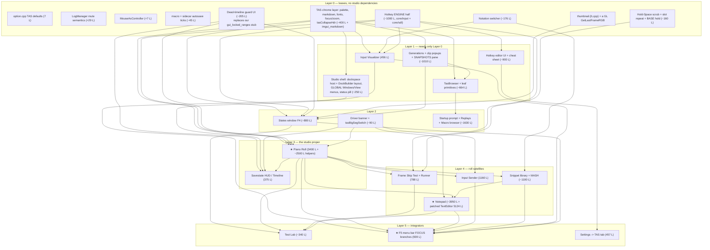

# David's TAS Studio — a component-by-component port dossier

`[MEASURED 2026-09-08]` unless a line says otherwise. Read-only investigation of
`/home/nbee/dev/davids_fly` (David's fork, a history-less snapshot at his head
`2026-09-05 05:34`) against `/home/nbee/dev/flycast-dojo` branch `dojo7` (ours). **Nothing outside
this file was changed.**

**Read `docs/DIVERGENCE-FROM-DAVID.md` first.** It establishes the temporal map, the evidence
grades, and the top-level shape of the gap. This document does not repeat that; it goes one level
down, into each studio component, with the detail a second engineer needs to actually port one.
Where the two documents disagree, §12 lists the corrections and this one wins — it was written
later and against the code.

Conventions used throughout:

- **HIS** = `/home/nbee/dev/davids_fly`, **OURS** = `/home/nbee/dev/flycast-dojo`. Every
  `file:line` says which tree, or is unambiguous from context.
- `[MEASURED]` = read out of the source or a command's output. `[INFERRED]` = my reasoning from
  what I read, which you should re-check before betting a day on it.
- Nothing here about speed is measured. Where David's own comments claim a number ("~27 fps
  readback"), that is *his* measurement on *his* machine, and is quoted as such.

---

## 0. The one-paragraph orientation

The divergence is almost entirely one translation unit. `core/dojo/dojo_gui.cpp` is **21,877 lines**
in his tree and **2,544** in ours (still the untouched dojo-7 netplay file); `core/rend/gui.cpp` is
**6,078** vs **5,015**. Everything those two files call into — the re-record engine, `session_inputs`,
`ApplyEdit`/`ApplyEditResize`, the undo stack and its `edit_meta_capture` hook, `.frame` sidecars,
clip folders, `clip.json`, generations, `hostfs::scanSavestateInfo`, `dojo.locked_slots`,
`MacroFlush`, `ReleaseTasHolds`, `savestate_epoch`, and all eight `tas_*` modules plus `mvc2.cpp` —
**is already at parity on our side, byte-for-byte** (verified by `md5sum`, §1.2). We have the engine
and none of the instrument panel. That is a much better starting position than "19,894 missing
lines" suggests, and it is also the trap: the UI is a *monolith* of ~351 file-static functions and
~235 file-static variables in one file, and the windows reach into each other's statics directly
rather than through interfaces. Porting is therefore mostly a **decoupling** exercise, not a
transcription one.

---

## 1. The measured shape of the gap

### 1.1 File sizes

| file | HIS | OURS |
|---|---:|---:|
| `core/dojo/dojo_gui.cpp` | 21,877 | 2,544 |
| `core/rend/gui.cpp` | 6,078 | 5,015 |
| `core/rend/mainui.cpp` | 315 | 258 |
| `core/dojo/dojo_gui.h` | 122 | 94 |
| `core/rend/gui.h` | 139 | 113 |

`dojo_gui.cpp` monolith metrics `[MEASURED]`: 351 lines matching `^static …(` (file-static function
definitions), 235 lines beginning `static` that are *not* function definitions (file-scope
variables). One symbol alone, `selSet` (the piano roll's selection), appears **104 times**.

### 1.2 What is already ours, verified

`md5sum` identical between the trees:

```
mvc2.cpp mvc2.h  tas_auto.cpp tas_auto.h  tas_clip.cpp tas_clip.h
tas_ruler.cpp tas_ruler.h  tas_wave.cpp tas_wave.h  tasmacro.cpp tasmacro.h
tastext.cpp tastext.h  tasva2.cpp tasva2.h  avi_dump.cpp
core/oslib/oslib.cpp  core/oslib/oslib.h
core/deps/imgui/{imgui.cpp,imgui.h,imgui_internal.h,imgui_widgets.cpp,imgui_draw.cpp,imgui_tables.cpp}
```

So: **ImGui is at exact parity** (`1.90.4` docking, only `imconfig.h` differs — that one is ours by
design), and the whole `tas_*` engine layer is at exact parity. `core/dojo/dojo.h` differs by one
line. `core/dojo/dojo.cpp` differs by 6/11 lines (the `pausing::` arbiter and the
`avi_dump`→`videorec` rename).

Engine hooks the studio needs, confirmed present in OURS:

- `Dojo::ApplyEdit` / `ApplyEditResize` — `flycast-dojo/core/dojo/dojo.cpp:1416`, `:1519`
- `undo_stack`/`redo_stack` + `edit_meta_capture`/`edit_meta_apply` — `dojo.cpp:1444`, `:1452`,
  `:1537`, `:1582` (the piano roll registers the meta callbacks to ride bookmarks on undo)
- `locked_ranges_cache` + `FrameLockedEmu` — `dojo.cpp:1366`
- `snapshot_prompt_*` / `snapshot_reveal` (F8 tag prompt + "reveal in States") — `dojo.cpp:1170-1177`
- `hostfs::scanSavestateInfo`, `MAX_SAVESTATE_SLOTS`, `savestateCycleCount`, `savestateFolderOverride`
  — `flycast-dojo/core/oslib/oslib.h:50,57,82,92`
- `.frame` sidecar reader, **v3** (`u32 frame`, `u32 rerecordSeq`, `u32 movieLen`, `u64 prefixHash`)
  — `flycast-dojo/core/oslib/oslib.cpp:226-245`

### 1.3 The two files we lack entirely

`core/dojo/thumbnail.cpp` (115 L) and `thumbnail.h` — see §2.17.

### 1.4 Vendored dependencies we lack

| dep | HIS path | size | needed by |
|---|---|---:|---|
| `imgui_markdown` (enkisoftware, zlib) | `core/deps/imgui_markdown/imgui_markdown.h` | 1,176 L | the TAS chrome layer (§2.0) and every help tooltip |
| `ImGuiColorTextEdit` (santaclose fork, **heavily patched by David**) | `core/deps/ImGuiColorTextEdit/{TextEditor.cpp,TextEditor.h,LanguageDefinitions.cpp,LICENSE}` | 3,285 + 535 + 1,283 + 21 L | the Notepad (§2.2) |
| fonts | `fonts/{JetBrainsMono-Regular,Roboto-Bold,Roboto-Italic}.ttf.zip` | — | mono editor faces + markdown bold/italic |

CMake wiring for these is 5 lines (`flycast-dojo/CMakeLists.txt` around `:704-715` and `:1003`).

**Do not take upstream ImGuiColorTextEdit.** `TextEditor.h` carries **36** `flycast-dojo` patch
markers and `TextEditor.cpp` **32**; `LanguageDefinitions.cpp` contains two wholly new grammars
David wrote — `LanguageDefinition::TasNotation()` at `LanguageDefinitions.cpp:915` (~222 L) and
`LanguageDefinition::Ppad()` at `:1138` (~119 L). Take his copy.

### 1.5 Windows coupling in `dojo_gui.cpp`

Smaller than feared. `#ifdef _WIN32` blocks at `davids_fly/core/dojo/dojo_gui.cpp:14, 56, 1794,
1816, 1827, 2195, 2221, 4574, 9212, 17975, 20651, 21511, 21524` — thirteen sites. The load-bearing
ones are:

- `tasMacroDialog` (`dojo_gui.cpp:2219-2254`) — `OPENFILENAMEW`/`GetOpenFileNameW`/`GetSaveFileNameW`.
  On non-Windows it is a stub returning `false`, so **Open/Save-As are dead on Linux as written.**
- `tasOpenDir` (`dojo_gui.cpp:4570-4581`) — already three-way (`ShellExecuteA` / `open` / Linux branch).
- `tasMarkdownLink` (`dojo_gui.cpp:54-63`) — `ShellExecuteA` for markdown link clicks.
- `_mkgmtime` vs `timegm` (`:9212`, `:20651`) — already `#ifdef`-paired.

So the real porting tax is **one host file-dialog shim**, not a rewrite.

---

## 2. Component dossiers

Each dossier answers the six questions: what it does, where it lives, what it depends on, what it
is coupled to, size/shape/difficulty, and what state it owns.

---

### 2.0 The TAS chrome layer — colours, markdown, fonts, focus/zoom, dockspace, studio host

**This is not optional and it is not a component. It is the substrate every other component sits
on.** Nothing below compiles without it.

**What it does for the user.** Gives the studio one visual language: a semantic palette where the
colour *means* something (green = READ, red = WRITE, amber = playhead, orange = staged, cyan = P1,
pink = P2), a near-white steady outline around whichever window currently owns the menu bar and the
hotkeys, Ctrl+wheel zoom on any tool window, and markdown-rendered help tooltips instead of walls of
plain text. F5 blanket-hides the whole studio; a capture in progress hides it too, so recordings are
clean.

**Where it lives (HIS).**

| piece | file:line |
|---|---|
| markdown wrapper (`tasMarkdown`, `tasMarkdownTooltip`, `tasHelpMarkerMD`, link + format callbacks) | `dojo_gui.cpp:43-124` |
| mono font picker `tasMonoFont` | `dojo_gui.cpp:125-137` |
| semantic palette `TAS_ACCENT/READ/WRITE/PROTECT/ACTIVE/STAGED/P1/P2/DIM/TEXT/BG/PANEL/PANEL_ALT` | `dojo_gui.cpp:139-151` |
| `tasCol` / `tasLit` / `tasDrk` | `dojo_gui.cpp:153-155` |
| derived tokens `TAS_WATCH`, `TAS_READWRITE`, `TAS_MENUBAR`, `TAS_FOCUS_RING` | `dojo_gui.cpp:158-170` |
| `tasGroupSep`, `tasCollapseHdr` (cfg-backed fold), `tasSecHdr` | `dojo_gui.cpp:174-239` |
| `tasPreviewGhostFlags` (input-transparent preview windows) | `dojo_gui.cpp:34-42` |
| focus model: `tasFocusNow`, `tasFocusPrev`, `tasLastClickT`, `tasSelectedKey` | `dojo_gui.cpp:6699-6703` |
| `tasZoomKeyName`, `tasActiveWindowOutline`, `tasResetAllZoom`, `tasWindowUiZoom` | `dojo_gui.cpp:6705-6769` |
| `tasStudioWindowZoom` (the same, exported for `gui.cpp`) | `dojo_gui.cpp:6771` |
| `tasStudioMode` / `tasMacroMode` | `dojo_gui.cpp:16915-16924` |
| studio window pump `DojoGui::show_tas_tool_windows` | `dojo_gui.cpp:16795-16878` (84 L) |
| dockspace host `tasDockspaceHost` + default DockBuilder layout | `gui.cpp:4217-4266` |
| `gui_set_game_viewport` / `gui_get_game_viewport` | `gui.cpp:719-736` |
| `tas_reset_layout_req` (global) | declared `gui.h`, set by the menu bar's View > Reset Layout |
| font block (JetBrains Mono, Consolas, Roboto Bold/Italic, 3 markdown heading sizes) | `gui.cpp:401-434` inside `gui_initFonts` |

**Dependencies.** `imgui_markdown.h` (must be included *after* `imgui.h` — see the comment at
`dojo_gui.cpp:23-24`); `ImFont*` globals `g_tasFontBold/Italic/H1/H2/H3`, `g_tasMonoJB`,
`g_tasMonoConsolas` (`dojo_gui.cpp:67-71,123-124`), populated by `gui_initFonts`; `os_GetSeconds()`
(never `dojo.frame_number` — the chrome must keep working while paused); the cfg store, using the
project's mandatory **virtual-first** write pattern (`cfgSetVirtual` then `cfgSave*`) so a `-config`
launch flag cannot permanently shadow a UI toggle.

**Coupling.** Everything depends on this; it depends on nothing above it. `tasWindowUiZoom` is called
by every tool window right after its `ImGui::Begin`, and is what sets `tasFocusNow` (which the menu
bar reads) and draws the focus ring. `tasStudioWindowZoom` exists purely so `gui.cpp`'s States window
— a different translation unit — can call the same function.

**Size and difficulty.** ~400 lines total plus the vendored markdown header. **Low difficulty, and
it is the mandatory first move.** It is a leaf: no dojo state, no savestates, no movie.

**State owned.** The per-window zoom keys, all `int` 60–140 default 100 (90 for `RollGridScale`), and
the fold-open keys. The canonical zoom-key list is `tasResetAllZoom`'s table at `dojo_gui.cpp:6739-6744`:
`RollUiScale, RollGridScale, NotepadUiScale, InputSenderUiScale, InputVizUiScale, TimelineUiScale,
SnippetsUiScale, MacrosUiScale, HotkeysUiScale, ReplaysUiScale, StatesUiScale, FrameSkipTestUiScale,
TestLabUiScale`. Plus `dojo:TasUi` (the F5 blanket flag) and `dojo:MacroMode`.

#### 2.0.1 The integration seam — and where ours already diverged

This is the single most important interface fact in the document, so it gets its own block.

**HIS: two ImGui frame streams, host submitted in both.**

- `gui_display_osd` (`gui.cpp:4270`) — the gameplay stream, called by the *renderers* from their
  present. `gui_newFrame()` at `:4280`, `ImGui::NewFrame()` at `:4281`, then **immediately**
  `dojo_gui.show_main_menu_bar()` at `:4287` and `tasDockspaceHost()` at `:4288`, then
  `gui_purge_stale_tick()` at `:4290`. The studio windows are submitted at `:4328-4333`:
  `show_savestate_overlay`, `show_hotkey_overlay`, `show_input_visualizer`, `show_piano_roll`,
  `show_tas_tool_windows`, `gui_draw_slot_picker`. `lua::overlay()` at `:4335`.
- `gui_display_ui` (`gui.cpp:4027`) — the menus/Paused stream. The `GuiState::Paused` case
  (`:4160-4171`) repeats the identical sequence: `show_main_menu_bar` → `tasDockspaceHost` →
  `gui_purge_stale_tick` → `show_pause` → `gui_draw_slot_picker` → `show_piano_roll` →
  `show_tas_tool_windows`. The comment at `:4162-4164` records why: `show_pause()` renders the whole
  overlay suite itself, so calling the individual overlays again there double-renders them.

The rule, from `IMGUI_UPGRADE.md` regression 3 and repeated in the code: **the dockspace host must
be submitted INSIDE the ImGui frame, BEFORE every dockable window, in the SAME stream as the
windows** — and in neither stream for states that render no tools. Release builds compile ImGui's
asserts out, so violating this corrupts docking state silently instead of crashing.

**HIS default studio layout** — `tasDockspaceHost` (`gui.cpp:4237-4252`) is also the canonical
inventory of studio windows, by their exact ImGui titles:

```
left   (28%): "Piano Roll"
right  (30%): "###seqnotepad" (Notepad; stable ### id under a dynamic title),
              "Input Sender", "Snippets", "Macros", "Frame Skip Test", "Test Lab"
bottom (32%): "Timeline", "Input Viz", "Hotkeys", "States"
centre      : left EMPTY on purpose — the game shows through the passthru central node
```

**OURS: the same rule, a different mechanism for the game.** We already have the host
(`flycast-dojo/core/rend/gui.cpp:448` `submitDockspaceHost`), submitted in `gui_display_ui` at
`:4368` for an enumerated set of GuiStates and in `gui_display_osd` at `:4515`. But we then took a
**different and, in my reading, better** design for the picture:

- HIS: the renderer letterboxes the framebuffer into the central node's rect, read via
  `gui_get_game_viewport` (call sites `davids_fly/core/rend/gles/gldraw.cpp:775` and
  `dx9/d3d_renderer.cpp:1276`; DX11 never wired).
- OURS: `core/rend/game_viewport.{h,cpp}` + `Renderer::GetFrameTexture()` + `submitGamePanel()`
  (`flycast-dojo/core/rend/gui.cpp:517`), which submits **the game itself as a dockable ImGui
  window titled "Game"**, docked into the central node `FirstUseEver`. Gated by `dojo:GamePanel`,
  with an A/B escape hatch `dojo:DockGameViewport` and a `dojo:ViewportTrace`.

**Consequence for every port below:** do **not** take `gui_set_game_viewport`/`gui_get_game_viewport`
or David's `gldraw.cpp` hunk. They are superseded. What you *do* take from `tasDockspaceHost` is the
`tas_reset_layout_req` DockBuilder block — and you must add `"Game"` to that default layout, or a
Reset Layout will orphan our game panel.

---

### 2.1 The Piano Roll ★

**What it does for the user.** The movie as an editable grid: one row per frame, one column per
button per player, with the playhead, savestate anchors, locked ranges and stale ("old take") regions
all painted into it. The authoring loop is: pause, scroll or click the FRAME gutter to seek, select
rows, and either paint cells directly or place a pattern into them. Concretely:

- **Two-button tool model** (David's design, not upstream's): **left** mouse is the selection tool
  with a full grammar (plain = replace + anchor, Shift = range, Ctrl = toggle, Ctrl+Shift = range-add,
  Alt = clear, drag = paint-on-snapshot); **right** mouse held is paint, a quick right *tap* is the
  context menu. `dojo:RollClassicPaint` swaps them. `selPress` `dojo_gui.cpp:12525-12559`,
  `paintStart` `:12563-12576`, right-press graduation `engageRight` `:12580-12597`, dispatch at
  `:15326-15353`.
- **FRAME gutter row surgery** — on the leftmost column, while paused and writable: Alt-drag
  **deletes** rows, Ctrl-drag **inserts** blanks, Ctrl+Shift-drag **duplicates**, Alt+Shift-drag
  **clears in place**; a modifier click without a drag does the single-row case. Arm/track
  `:12672-12744`, gutter press `:15221-15258`.
- **SET BRUSH** — type a pattern into the MASH field, click Set Brush (`:13126-13137`), and a
  right-drag now *stamps that whole pattern* instead of painting one column, at a chosen cadence
  (every row / every 2nd = 30 Hz / every 3rd = 20 Hz, `:13088-13099`). While armed it live-mirrors
  the MASH fields (`:13151-13173`).
- **MOVIE MAP heat map** (`:14486-14608`) — input density per bucket across the whole movie with
  bookmark bands, locked-range dimming and a playhead marker; click or drag to scrub.
- **WAVE column** (`:15300-15340`) and a **waveform lane** under the map (`:14610-14694`) — the audio
  envelope per frame, 16-slice peak/RMS bars, so attack cues are readable with sound off; grey means
  "old take". Backed by `tas_wave::snapshot/version/measuredFrames`.
- **REL ruler** (`:15496-15602`, base computed `:12439-12476`, header `:12680-12717`) — a Vim
  `relativenumber` column showing each row's distance from a base (playhead / clicked caret /
  Shift-clicked anchor / nearest state / nearest bookmark, per `dojo:RulerBase`), plus MvC2's
  skip-frame glyph from `tas_ruler`.
- **INPUT TOOLS fold** (`:13082-13733`) — brush cadence, the bookmark popup, and the whole MASH bar.
- **EDIT TOOLS fold** (`:13741-14484`) — RANGE (typed bounds), ERASERS (Clear vs Delete, distinct
  ops with distinct undo entries), TRANSFORM (P1↔P2 swap, flip L/R, clone), CAPTURE (copy / save
  macro), PASTE (replace / insert / append / fill), LOOP (tile ×N), BLANKS, and the shared TARGET
  picker footer.
- **Bookmarks** — named frame spans stored per clip; popup `:13061-13210`, context-menu entries
  `:14964-15008`, Ctrl+Shift+0–9 sets a slot and Ctrl+0–9 jumps (`:12986-13026`).
- **Undo/redo** — buttons and Ctrl+Z / Ctrl+Shift+Z (`:12915-12942`) driving `dojo.ApplyUndo()` /
  `ApplyRedo()`; a read-only HISTORY tree of the last 12 entries at `:14696-14710`.
- **Read/write gating** — nearly every mutating control is behind `paused && !dojo.play_match`, with
  a reason tooltip ("READ — press R to author" / "Pause first"). Recurring predicate at `:12565`,
  `:12916`, `:13502`, `:13854`, `:14338`, `:14442`.

**Where it lives.** `DojoGui::show_piano_roll`, `davids_fly/core/dojo/dojo_gui.cpp:12379-15778` —
**3,400 lines**, the largest single function in his tree `[MEASURED via brace balance]`. Structure:

| range | content |
|---|---|
| 12379-12393 | gating (`TasUi`, `PianoRoll`, `avi_dump.isRecording()`), clears an in-flight gutter drag, bookmark load + history hook |
| 12395-12520 | cfg reads, REL base computation, skip cache, selection derived state |
| 12525-12676 | selection / paint / right-press lambdas; row-op lambdas (`doInsertRows`, `doDeleteRows`, `doPaste`) |
| 12672-12744 | resolve a pending gutter modifier-drag on mouse-up |
| 12746-12852 | `Begin("Piano Roll", …, MenuBar)`, Selection menu, focus/zoom/glow, driver banner |
| 12853-13051 | CONTROL row, stale banner, undo/redo, clipboard, bookmark slot keys |
| 13082-13733 | INPUT TOOLS fold (brush, bookmarks popup, MASH bar) |
| 13741-14484 | EDIT TOOLS fold |
| 14486-14710 | MOVIE MAP fold, waveform lane, HISTORY |
| 14712-14842 | `BeginTable("proll", 2 + waveCols + NCOLS*2 + rulerCols, ScrollY\|BordersInnerV\|RowBg)`, `TableSetupScrollFreeze`, **hand-built header row** (arrow glyphs via `AddTriangleFilled`, not `TableHeadersRow()`) |
| 14859-15129 | `dragEndRow` hysteresis, `rowIsLocked`, follow/jump, cursor shape, right-click menu body |
| 15129-15131 | `switch (tasRollAct)` — the F5 menu bar's command channel |
| 15131-15602 | `ImGuiListClipper` row loop: row bg, FRAME gutter, WAVE cell, per-player per-column cells, REL cell |
| ~15602-15700 | edge auto-scroll; paint-stroke commit → one `dojo.ApplyEdit` per stroke |
| 15773-15778 | `End()`; on close, `cfgSetVirtual`+`cfgSaveBool("dojo","PianoRoll",…)` |

Drawing: **one `ImGui::BeginTable` + `ImGuiListClipper`** for virtualization, `TableSetBgColor` with
`ImGuiTableBgTarget_RowBg0`/`RowBg1` layered (selection/playhead on one, locked/stale on the other),
and raw `ImDrawList` for arrows, WAVE bars, REL text, heat map and lane.
`ImGuiHoveredFlags_AllowWhenBlockedByActiveItem` is load-bearing for drag-select/drag-paint (a
comment names the exact bug). None of this needs the docking branch specifically — the tables API is
older — but the window participates in the studio dockspace as an ordinary dockable window.

**Dependencies.**

- **Movie**: `dojo.session_inputs`, `dojo.frame_number`, `dojo.play_match`, `dojo.macro_armed`,
  `dojo.rerecord_count`, `dojo.stale_tail_from`, `dojo.load_seq`, `dojo.undo_stack`/`redo_stack`,
  `dojo.ApplyUndo/ApplyRedo` (`:12918`, `:12927`), `dojo.MacroAnchorFrame` (`:12790`, `:12793`).
  Writes go through `dojo.ApplyEdit` (paint-stroke commit at the tail) and, via
  `tasInsertRows`/`tasDeleteSel` (`:3342`, `:3363`), `dojo.ApplyEditResize`. It never calls
  `MapleRecordAction`/`MapleApplyAction` directly.
- **Savestates**: `gui_state_frames` (`:12455`, `:14606`, `:14882`), `gui_locked_ranges` (`:14586`,
  `:14887`), `gui_slot_stale` (`:15193`, `:15272`), `gui_stale_blink`/`_deleted` (`:12873`, `:12880`),
  `hostfs::savestateFolderOverride` (`:12856`, and the bookmark gates at `:13001/13123/13174/13179`,
  `:14996` — bookmarks require an attached clip). It does **not** call `gui_saveState`/`gui_loadState`.
- **TAS modules**: `tas_wave::{FrameEnv, version, measuredFrames, snapshot}`, `tas_ruler::{onPausePeek,
  version, snapshot, SkipSample}`, `tas_macro::{Macro, Frame, CANON_*}`, and `tas_clip::read/write`
  transitively through `tasClipMetaRead/Write` (`:2704-2712`) for bookmarks. **No `tas_mvc2`, no
  `tas_auto`, no `tas_va2` references inside the roll body** `[MEASURED]` — the roll itself is
  game-agnostic; the MvC2 knowledge lives in its satellites.
- **cfg keys written**: `PianoRoll`, `RollUiScale`, `RollGridScale`, `RollDirArrows`, `RollWave`,
  `RollWaveLane`, `RollRuler`, `RulerBase`, `RulerSigned`, `RulerDigits`, `RulerSkipOffset`,
  `RulerSkipCounts`, `RollClassicPaint`, `PurgeStale`, plus fold keys `RollSecBuild`, `RollSecEdit`,
  `RollSecMap` through `tasCollapseHdr`.
- **Windows**: none directly; transitively `tasFolderIcon` (`ShellExecuteA`), `tasMacroDialog`
  (commdlg, reached from CAPTURE > Save Macro), `tasMarkdownLink`.

**Coupling — the honest part.** The roll shares file-statics with almost every other window. The
ones that matter:

| static | declared | also touched by |
|---|---|---|
| `selSet`, `selAnchor`, `selDragBase`, `selDragging`, `selDragEnd` | `dojo_gui.cpp:2509-2516` | Notepad (Selection menu), Input Sender (send target), Snippets ("+ selection"), Frame Skip Test (`fstCaptureSelection`), Test Lab (`labOpenTest` reseeds it), F5 menu bar (Edit menu gate) |
| `tasRollAct` (`RA_*`) | `:12374-12376` | **written by the F5 menu bar** `:18081-18113`, consumed by the roll's `switch` at `:15129` |
| `mashWantLoad`, `mashLoadP1/P2`, `mashLoadedFile` | `:2539-2541` | Snippets window stages a MASH load here (its own comment says it cannot reach the roll's function-local statics) |
| `tasBrushArmed`, `tasBrushP1/P2`, `tasBrushGap` | `:2534-2536` | Snippets `seqLoadIntoMash` arms the brush |
| `tasStaged`, `tasStagedBase`, `tasStagedXforms`, `tasStagedRev` | `:3794-3825` | Macros/Snippets window stages a macro; the roll's TRANSFORM/PASTE switch into "edit the staged buffer" mode when non-empty |
| `tasSendTarget` + `tasTargetPicker` | `:4496-4497` | shared TARGET row for MASH, LOOP, BLANKS, PASTE **and** the Input Sender |
| `tasActiveSender` (`SND_ROLL/SND_IS/SND_NP`) | `:6679-6680` | one mutually exclusive "who owns the glow" state machine shared with Input Sender and Notepad |
| `tasBookmarks`, `tasBookmarksClip` | `:2723-2724` | clip.json bookmarks; also read by the Notepad's Pull-Bookmark menu |
| `fstRunning` | `:2510` | Frame Skip Test sets it so the roll does not fight its automated loads |
| `tasJumpTo` | `:2916` | scroll-jump request other windows can set |

**If you port the roll alone**, the grid mechanics work and these break: MASH's snippet dropdown
(needs the Snippets library), TRANSFORM/PASTE staged-macro mode (needs the Macros window),
`tasRollAct` verbs from the menu bar (redundant — the roll's own buttons still work), Frame Skip
Test launch from the context menu, and the send-glow ring. All are excisable; the grid is not
excisable from `dojo.ApplyEdit`/`ApplyEditResize`/`undo_stack` (which we have) or from the four
`gui_*` savestate query functions (which we do not — §2.5).

**Size and difficulty.** 3,400 lines in the function; realistically **2,500–3,000 more** in
non-contiguous supporting helpers scattered from `dojo_gui.cpp:153` to `:12378`. Self-containment
**low-to-medium**: the bottom two-thirds (grid, gutter, clipper, heat map, ruler, wave) is close to
liftable; the top third (INPUT/EDIT TOOLS) is welded to sibling-window state. **Difficulty: highest
in the document.** Multi-day even for the reduced grid-only version, and the reduced version is what
I would attempt first.

**State owned.** cfg keys above; `clip.json` `"bookmarks": [{name, frame, end}]` read/written by
`tasBookmarksLoad`/`Save` (`:2725-2754`) as a read-modify-write of the whole JSON object; and
bookmarks ride the undo stack as an opaque blob through `dojo.edit_meta_capture`/`edit_meta_apply`,
registered once by `tasBookmarksHookHistory` (`:2760-2791`, called every frame at `:12393` but
installing once). Everything else — selection, brush, MASH field text, RANGE bounds, REL caret — is
session-only in-memory.

---

### 2.2 The Notepad ★

**What it does for the user.** Author a combo as *text* and push it into the movie; or pull a stretch
of the movie back out as text and read it. One buffer line = one emulated frame. Two independent
`TextEditor` instances hold P1's and P2's tracks side by side, zipped into one timeline on read and
split again on write; a one-column mode shows a single player (Tab swaps). Five notations render the
same underlying bits: **Numpad** (`236`), **Cardinals** (`U/D/L/R`), **Glyphs** (read-only symbol
view with a click-to-edit inline pad), **CE** (the Demul trainer letters — the canonical on-disk
format, byte-exact round trip), and **PPAD / V PRO** (the 2009 ASCII-pad step dialect, `2lp14`,
`236hk12`, `[lp/hp]*360`, where holds and durations are baked into one token). Switching notation
live-converts the buffer.

The loop: open a file (File > Open, a snippet row, "Edit loaded macro", or OS drag-and-drop) or start
scratch → type → live diagnostics squiggle parse errors red and warnings amber (unknown CE letters,
assumed-A1 assist slots, lowercase-reads-as-CAPS) → **Send** Replace / Insert / Append / Merge at a
target frame, or **Send → Live** to drive the guest in real time → **Pull From…** to read a range back
in → Save, which always writes canonical CE letters plus comments so the archive format never depends
on what you were looking at.

**Where it lives (HIS).** Total notepad-specific code in `dojo_gui.cpp`: **~3,949 lines**, ~18% of
the file.

| region | lines | content |
|---|---|---|
| 4600-4922 | ~322 | appearance profiles (`NpProfile`, per-notation × per-side colours, `npProfSave`, `npProfApply`, legacy-key migration) |
| 4913-5263 | ~350 | parse: `tasCEFrameLine`, `tasVa2Inline`, `tasNotepadParseLine`, `ParseAll`, `Render` |
| 5264-5458 | ~194 | diagnostics/squiggles, step collection, PPAD gutter info |
| 5459-5880 | ~421 | lint, PPAD unfold/reflow, per-track render, zip/even panels |
| 5885-6210 | ~325 | file ops: open/unload/from-movie/pull-rows/pull-from-frame, snippet rename |
| 6210-6520 | ~310 | V PRO import (`tasVa2ToLines`, `ImportVa2`, `ImportPopup`, clipboard sniffing) |
| 6521-6772 | ~251 | save/save-as/open, find-replace, `tasNotepadBuildMap` |
| **6773-8328** | **1,556** | `tasNotepadWindow` itself |
| 18117-18336 | ~220 | **its File/Edit/Selection menus, which live in the F5 menu bar, not in the window** |
| 19768-19787 | ~20 | `tasNotepadToScratch` |

Inside `tasNotepadWindow`: chrome + window hotkeys `6773-6906`; macro load/unload + Pull-From popup
`6907-6997`; shelved Sync-with-Movie `6998-7024`; notation/2-col/PPAD/Follow row `7025-7159`; import
+ appearance popup `7160-7305`; find/replace `7306-7368`; diagnostics strip `7369-7466`; **send row
`7468-7681`**; text zoom `7682-7715`; **Glyphs branch `7716-8213`**; **real editor branch
`8214-8322`** (the two `TextEditor::Render()` calls, PPAD gutter labels, step badges, and a
custom-drawlist PPAD step-timeline strip).

**Dependencies.**

- **The vendored editor.** APIs used: `SetLanguageDefinition(LanguageDefinitionId::TasNotation|Ppad)`,
  `SetPalette`/`SetPaletteColor`/`SetBoldPalette`, `SetFontScale`, `SetLineSpacing`, `SetGutterScale`,
  `SetLineNumberStart(0)`, `SetLeftMargin`, `SetHighlightLine`, `SetDiagnostics` (+ the `Diagnostic`
  struct), `SetDecorations`, `SetGutterLabels`/`GutterLabel`/`ClearGutterLabels`, `GetUndoIndex`,
  `GetSelectedLineCount`, `SelectRegion`, `Set/GetCursorPosition`, `SetViewAtLine(...Centered)`,
  `SelectNext/Previous/AllOccurrencesOf`, `AnyCursorHasSelection`, `Set/GetTextLines`, `AppendLines`,
  `RequestFocus`, `Render(id, takesKeys, size, showBorder)`.
- **Movie**: `dojo.session_inputs`, `dojo.frame_number`, `dojo.play_match` (gates every send),
  `dojo.ApplyEdit` (`:7473-7509` for the Merge diff), `dojo.MacroAnchorFrame` (`:7159-7161`),
  `dojo.loaded_macro_path`, `dojo.send_merge`, `dojo.macro_save_pending`, `dojo.WriteMacroFile()`,
  `dojo.frameskip_send_pending`, `dojo.load_seq`, `dojo.recording_started`.
- **TAS modules**: `tas_macro` (canonical frame + CE codec — a `static_assert` at `:6216-6222` pins
  `tas_va2`'s bit values to `tas_macro`'s), `tas_va2` (`LooksLike`/`Parse`/`Expand`/`Fold`,
  `AssistPolicy`), `tas_auto::playLive` (Send → Live), `hostfs::savestateFolderOverride` +
  `scanSavestateSlots` (Pull-from-state).
- **Shared roll helpers** it calls: `tasSelectionToMacro` (`:3114`), `tasMacroPlaceFrames` (`:2362`),
  `tasInsertRows` (`:3342`), `tasMacroMergeFrames` (`:2384`), `tasParseMash` (`:3508`),
  `tasCanonToPacket`/`tasPacketToCanon` (`:2283`/`:2304`), `tasTargetPicker` (`:4497`),
  `tasNotationCombo` (`:4465`), `tasArmFrameskipSend` (`:2920`), `tasDriverBanner` (`:6798`).
- **cfg**: `NotepadOpen`, `NotepadPath`, `NotepadLib`, `NotepadLibFile` (written by
  `show_tas_tool_windows` at `:16864-16877`), `NotepadSplit`, `NotepadGutterFrames`,
  `PpadStepsPerLine`, `NotepadMonoFont`, `NotepadFontScale`, `NotepadLineSpacing`,
  `NotepadGutterScale`, `NotepadCustomCol`, `NotepadHasDef`, the per-profile
  `Np{Text,Glyphs,Ppad}_*` family (`npProfSave`, `:4847-4864`), `NotepadUiScale`, `StageMacroFile`.
- **Windows**: File Open/Save-As go through `tasMacroDialog` → dead on non-Windows.

**Coupling.** Worse than the roll in one specific way: **its menus are not in it.** File, Edit and
Selection live in `show_main_menu_bar` (`:18117-18336`), gated on `tasSelectedKey ==
"NotepadUiScale"`. Port the window alone and you lose Save, Import, and every Selection-pull unless
you reimplement the dispatcher. It also reads `selSet` (the roll's live selection) directly for its
send target, and shares `seqLib`/`seqLibDir`/`seqLibSave` with the Snippets library
(`seqRenameEntry` at `:5981-6047` even repoints an open buffer if the file it names is renamed).

**Size and difficulty.** ~3,949 lines of studio code plus a 5,124-line vendored, patched editor.
Self-contained: the parse/notation/appearance half genuinely is; the window half is not.
**Difficulty: very high** — the 1,556-line window body is the *smaller* half of the job.

**State owned.** The cfg family above; the open file on disk (`notepadPath`). **There is no notepad
autosave.** The two ticks in `gui.cpp` are for other things: `gui_macro_autosave_tick`
(`gui.cpp:3976-3995`) rewrites the clip's *movie* macro `.txt` when `dojo.macro_save_pending` is set,
and `gui_tas_sidecar_autosave_tick` (`:4001-4025`) flushes the wave envelope and skip map. An edited,
unsaved buffer is protected only by the `notepadDirty` guard on Open/Unload/New — a crash loses it.
Both ticks were written after real data loss (`dojo.h:310` "the 2026-09-03 loss — two force-killed
sessions"), and are worth taking early and cheaply on their own.

---

### 2.3 The F5 studio command bar

**What it does for the user.** One `BeginMainMenuBar` strip whose *contents change with the focused
window*. Two modes:

- **GLOBAL** (white bar, `tasSelectedKey == nullptr`): a `[MAIN]` chip back to the last selection,
  stub File/Edit/Cheats/Debug/Help, a real **Windows** menu (open/close every tool plus States), a
  real **View** menu (Reset Layout, Reset All Zoom), and a right-aligned status pill (run state,
  mode, save state, live generation).
- **FOCUS** (steel-blue bar): the bar *becomes that window's own menu* — a chip that doubles as
  Deselect, then window-specific menus, plus a shared View menu with "Reset This Window's Zoom".

The selection gesture is deliberate: a window sets `tasFocusNow` when it takes ImGui focus, but the
bar only promotes that to `tasSelectedKey` if the focus change followed a real left click within
0.35 s (`tasLastClickT`, `:17902-17909`) — so a programmatic focus, or clicking the bar itself,
cannot steal or drop the selection.

**Where it lives.** `DojoGui::show_main_menu_bar`, `dojo_gui.cpp:17893-18831` — **939 lines**.

| range | menu |
|---|---|
| 17893-17933 | gating, click tracking, focus→selection promotion, mode decision, `BeginMainMenuBar` |
| 17934-18030 | `drawStatus` lambda (the right-aligned pill) |
| 18031-18046 | FOCUS chip / Deselect |
| 18047-18116 | **Piano Roll** File + Edit |
| 18117-18212 | **Notepad** File + Edit |
| 18213-18336 | **Notepad** Selection (pull selection / state range / state-onward / bookmark) |
| 18337-18408 | **Macros** Macro + Columns |
| 18409-18442 | **States** States |
| 18443-18459 | **Hotkeys** Hotkeys |
| 18460-18492 | **Input Sender** Edit |
| 18493-18553 | **Input Viz** Pads + Time table |
| 18554-18627 | **Snippets** Snippet + Library |
| 18628-18680 | **Timeline** State |
| 18681-18757 | shared FOCUS View menu |
| 18758-18763 | pop, `drawStatus()`, `EndMainMenuBar`, early return |
| 18764-18830 | GLOBAL mode: stub menus, `[MAIN]`, **Windows**, **View**, status |

**Dependencies — this is the point of the component.** Every FOCUS branch reaches directly into
another window's file-statics. Non-exhaustive but the load-bearing set:

- Piano Roll: `selSet` (`:2509`), `tasRollAct` (`:12376`) — writes `RA_CLEAR/DELETE/SWAP/FLIPLR/
  P1P2/P2P1/COPY/CUT/SAVEMACRO/PASTE_REP/PASTE_INS/INSBLANK/REPEAT/FST/DESELECT` at `:18081-18113`,
  `tasBlankN`/`tasRepN` (`:3256-3257`), `tasClipHasText()` (`:4555`).
- Notepad: `notepadOpen/Path/Dirty/Name/File/IsLibrary/Style`, `notepadDiagPpad/Err`, `npBaseValid`,
  `npFollow`, `npPullAppend` (`:6106`), `npFindBuf`/`npReplBuf` (`:6611`), `npWantColors` (`:6614`),
  `npWantImport` (`:6223`), and `TextEditor& npActiveEd()` called at `:18177`.
- Macros: `macrosBrowserOpen` (`:9078`). Input Sender: `inputSenderOpen` (`:10028`), `isQueue`
  (`:10039`, **cleared in place** at `:18467-18468`), `isThrow` (`:10041`, bound straight to a
  `SliderFloat` at `:18487`). Input Viz: `ivTimeH` (`:17140`, read/written at `:18514-18518`).
  Snippets: `seqLibOpen`, `snippetBrowser.selKey`, `seqScope`, `seqSearch`, `seqLib`,
  `seqRenameFile/Buf/WantRename`. Timeline: `timelineOpen` (`:10029`), `slotLocked`/`slotToggle`
  (`:17860`/`:17865`).
- **The two exceptions that prove decoupling is possible**: States and Hotkeys are reached only
  through exported functions and cfg — `gui_states_is_open()`/`gui_states_set_open()`
  (`gui.cpp:5017-5021`), `dojo.ArchiveGeneration()`, `hostfs::savestateFolderOverride`,
  `gui_open_settings_direct()`, `tasHotkeyOrderLoad()`. That is the pattern to retrofit onto the rest.
- Shared: `tasNotation` (`:4336`) written from two different menus; `tasBookmarks` (`:2723`).

**Coupling.** Every FOCUS branch is gated `!strcmp(sel, "...UiScale") && <windowOpenFlag>`, so it is
*runtime*-defensive against a missing window — but not *compile*-defensive: file-statics are not
optional symbols. A partial port means mechanically deleting the branches for windows you did not
bring. Frame Skip Test and Test Lab already demonstrate the degraded case: they appear only as
`Windows`-menu checkboxes (`:18805-18806`) with **no FOCUS branch at all**, so clicking into them
leaves only the shared View menu.

**Size and difficulty.** 939 lines. **The genuinely reusable part is the shell** — the
focus-follows-click selection model, `tasWindowUiZoom`, `tasActiveWindowOutline`, the dockspace host,
the GLOBAL Windows/View menus and the status pill. That is maybe 250 lines and is **low difficulty**.
The FOCUS menu *contents* cannot be ported ahead of their windows. **Port the shell early, the
branches with their windows, and the whole function last.**

**State owned.** `tasSelectedKey`/`tasLastSelected`/`tasFocusNow`/`tasFocusPrev`/`tasLastClickT` —
session only, not persisted. The window open flags, persisted by `show_tas_tool_windows`
(`:16864-16877`). `imgui.ini` persists dock positions and tabs but **not** which windows are open —
which is exactly why that hand-rolled persistence exists. Every headless harness must pass
`-config dojo:UiIni=no`.

---

### 2.4 The States window (F4)

**What it does for the user.** All 100 savestate slots as one thumbnail wall. A slider (40–400 px)
sizes the cards; below 72 px they degrade to badge-only tiles (David's original board), and a
board-layout option forces ten per row so slot number equals position. Cards are colour-coded (gold =
BASE/slot 0, green = occupied, dim = empty, red-tinted = stale) and carry the slot number, the user's
label and the anchored movie frame. Sort (slot / movie frame / newest) and a label filter with
hide-empty narrow the wall — in board layout, filtered-out slots dim in place so addresses stay
stable. Right-click a card for Load / Save (with an Overwrite-BASE confirm) / Lock / Add to Test Lab /
Shift-confirmed Delete. A single-subject details column shows the *selected* slot's facts. Under the
wall sits the clip's shared GENERATIONS pane.

Arrow / D-pad navigation walks the **displayed** order, so it survives sorting and filtering — and it
is gated to **paused or read-only playback only**, because those same arrows are the guest's D-pad.
Floating, Enter/A/B close on the highlighted slot; docked as a studio module, it never closes on Load
or Enter, takes arrows only while focused, and Esc closes it.

**Where it lives (HIS `core/rend/gui.cpp`).** Statics `slot_picker_open`/`slot_picker_focus` at
`:4675-4676`.

| function | lines |
|---|---|
| `SlotThumb` + `getSlotThumbnail` | 4686-4735 |
| `slotScan` | 4747-4763 |
| `humanSize` / `slotTimeText` | 4972-4980 / 4985-4997 |
| `gui_open_slot_picker` / `gui_show_slot_picker` | 5001-5006 / 5010-5015 |
| `gui_states_is_open` / `gui_states_set_open` | 5017 / 5018-5023 |
| `slotFillColor` | 5028-5036 |
| `drawSlotLabelEditor` | 5041-5075 |
| `drawSlotPreviewImage` | 5077-5099 |
| `drawSlotFacts` | 5102-5118 |
| `slotTooltip` | 5121-5152 |
| `gui_lab_add_test` | 5155-5201 |
| `slotRowMenu` | 5203-5266 |
| `drawSlotBrowser` | 5269-5547 |
| `gui_draw_slot_picker` | 5549-5742 |
| `gui_cycle_savestate_slot` | 5744-5760 |

**Dependencies.**

- `hostfs::` — all present in OURS byte-identically: `scanSavestateInfo`, `MAX_SAVESTATE_SLOTS`,
  `savestateCycleCount`, `currentSavestateSlot`, `savestateFolderOverride`, `deleteSavestate`,
  `load/saveSavestateLabel`, `getSavestatePath`, and the `SavestateInfo` struct including
  `rerecordSeq`/`haveSeq`/`prefixHash`.
- `dojo.` — `locked_slots`, `base_prelock`, `savestate_epoch`, `rerecord_count`, `rewind_log`,
  `IsStateStale`. All present in OURS.
- The guard functions (§2.5) — `gui_slot_stale` at `:5106` and `:5375`, `gui_stale_blink`. **The wall
  cannot be ported without the guard**, short of stubbing those calls.
- Hooks into `dojo_gui.cpp` that we lack: `tasSlotLocked`/`tasSlotToggle` (`dojo_gui.cpp:17884-17885`),
  `tasStudioWindowZoom` (`:6771`), `DojoGui::show_state_backups` (`:17579`),
  `states_snapshots_height`/`min_height` (`:17642`/`:17650`), `show_states_snapshots` (`:17658`),
  called from `gui.cpp:5545` and `:5640-5651`.
- `gui_lab_add_test` needs `tas_clip::labNewTestDir`/`seed`/`bump`/`labIsActive` (present in OURS,
  unused) and `gui_lab_write_roll_macro` (in `dojo_gui.cpp:2447`, absent).
- Thumbnails — `tas_thumb::` → `renderer->GetLastFrameRGB` (§2.17).
- Hotkey — `EMU_BTN_SLOT_PICKER`, dispatched at `davids_fly/core/input/gamepad_device.cpp:269-274`.
  **Zero matches for that enum anywhere in OURS** `[MEASURED]`.
- cfg: `StatesOpen`, `StatesThumbW`, `StatesBoardCols`, `StatesPreview`, `SlotBrowserSort`,
  `SlotBrowserHideEmpty`, `StatesSnapshotsPaneH`, `StatesUiScale`, `PurgeStale` (read), `TasUi`,
  `MacroMode`.
- ImGui: **no tables and no clipper** — 100 slots are drawn unclipped every frame with `Selectable`
  plus raw `ImDrawList`. `BeginChild` with `HorizontalScrollbar`; `BeginPopupContextItem` /
  `BeginPopupModal`; nav via `IsKeyPressed(..., true)` and `ImGuiKey_GamepadDpad*`/`GamepadFace*`;
  `ImGuiFocusedFlags_RootAndChildWindows` to gate docked-module nav.

**Coupling.** Needs the guard (hard). Needs the generations pane (§2.8) for the bottom half, but that
pane is deliberately host-agnostic — States registers as just a fourth `ClipUiHost` (`clipUiStates`,
`dojo_gui.cpp:9156`) bound to `hostfs::savestateFolderOverride` instead of to a browser row. Needs
the chrome layer for `tasStudioWindowZoom`. It **gracefully degrades without the studio**: `if
(studio) … else …` at `gui.cpp:5577-5591` gives a floating-window-only path.

**Size and difficulty.** ~1,086 lines for the whole `gui.cpp:4675-5760` block, of which ~789 is the
window proper and ~80 the shared scan/thumbnail infra. **Difficulty: high**, mostly because of what
it drags in (guard + generations pane + thumbnails + a new hotkey action end to end).

**State owned.** The cfg keys above. Per-slot sidecars `.frame` / `.png` / `.label` / `.wave`, all
removed together by `hostfs::deleteSavestate`. In-memory caches with explicit invalidation:
`slotScan`'s static vector refreshes on `dojo.savestate_epoch` bump **or** a 0.5 s wall-clock tick
(`gui.cpp:4759`); `gui_slot_stale`'s memo additionally keys on `slotScanGen`, `dojo.rerecord_count`
and `dojo.rewind_log.size()` (`:4776-4787`) because `IsStateStale` re-hashes the movie prefix and the
wall polls it ~200×/frame; the thumbnail texture cache invalidates on PNG mtime **and** size (mtime
alone is 1 s coarse).

---

### 2.5 The dead-timeline guard UI

**What it does for the user.** After you rewind and re-record below a savestate's anchor frame, that
state still loads and still byte-verifies — but its machine belongs to an abandoned branch, so
loading it and playing forward desyncs. The guard makes that visible and, optionally, cleans it up:
stale slots get a red tint; for ~3 s after the triggering rewind their cards blink (red = the files
were auto-deleted, orange = kept and marked); `dojo:PurgeStale` auto-deletes newly-staled non-BASE
states (BASE is permanently exempt); a manual "purge stale states" removes them on demand. The same
machinery computes the **locked input ranges** the roll greys out and every writer refuses.

**Where it lives (HIS `core/rend/gui.cpp`).**

| function | lines |
|---|---|
| `gui_slot_stale` | 4766-4788 |
| `gui_purge_stale_now` | 4807-4826 |
| `gui_purge_stale_tick` | 4829-4849 |
| `gui_state_frames` | 4851-4859 |
| `gui_slot_frame` | 4861-4866 |
| **`gui_locked_ranges`** | 4874-4910 |
| `gui_frame_locked` | 4912-4920 |
| `gui_stale_blink_deleted` | 4927-4930 |
| `gui_stale_blink` | 4932-4970 |

**≈205 lines.**

**The finding that makes this the highest-leverage item in the document.** Our engine already calls
into this and gets a lie:

```
flycast-dojo/core/rend/gui.cpp:5012   void gui_locked_ranges(std::vector<std::pair<u32,u32>>& out)
                                      { out.clear(); }      // the whole body
flycast-dojo/core/rend/gui.h:33-40    the comment explaining it is a stub
flycast-dojo/core/dojo/dojo.cpp:1416  gui_locked_ranges(lr);   // ApplyEdit consults it
flycast-dojo/core/dojo/dojo.cpp:1519  gui_locked_ranges(lr);   // ApplyEditResize consults it
flycast-dojo/core/dojo/dojo.cpp:1366  Dojo::FrameLockedEmu reads locked_ranges_cache
```

Both `ApplyEdit` paths and the emu-thread `FrameLockedEmu` are **already wired and already correct**
in our tree — and are permanent no-ops because nothing can populate the list. Porting ~205 lines of
pure GUI-side computation turns three existing, dead engine call sites into live ones.

**Dependencies.** `dojo.locked_slots`, `base_prelock`, `rewind_log`, `IsStateStale`, `rerecord_count`
(all present); `hostfs::scanSavestateInfo`, `deleteSavestate` (present); `os_GetSeconds`;
`gui_display_notification`. `.frame` sidecar v2/v3 read through `scanSavestateInfo`. `clip.json`
`rewinds` is written by `Dojo::WriteClipStats` (`davids_fly/core/dojo/dojo.cpp:960-964`) and read
back at `:842-846` — both present in OURS. `tas_clip.cpp` only *merges* `rewinds` during a
backup/restore (`tas_clip.cpp:361`). cfg: `PurgeStale` (read at `gui.cpp:4836`; the checkbox that
writes it is in the TAS settings tab).

**Coupling.** **Separable in one direction only.** The guard needs nothing from the States window,
the roll, or `dojo_gui.cpp` — it is the one piece of the studio that is genuinely a leaf on the UI
side. The States window and the roll both need it.

**Size and difficulty.** ~205 lines. **Low-to-moderate difficulty; roughly a day.** Drop in seven
functions, declare them in `gui.h`, add the `gui_purge_stale_tick()` call to both frame streams.

**State owned.** `dojo:PurgeStale`. In-memory: the stale memo and its invalidation key; the blink
window's `lastRewinds`/`lastStale[100]` flip detector. Nothing new on disk — the verdict is derived
from `clip.json` `rewinds` plus the per-state sidecar `rerecordSeq`, both of which we already write.

---

### 2.6 The TAS hotkey system

**What it does for the user.** Eighteen TAS actions, rebindable per action **and per device**, in a
Settings → TAS → HOTKEYS table with a Keyboard column and a Gamepad column. Click a cell to arm
detect mode on that device; the next press is consumed *inside* the device layer and reported back,
so a rebind press can never also step a frame or move the guest. A gamepad binding accepts a button
**or one analog direction** (push the stick, XPadder-style, so left and right on the same axis can
drive different actions). An action can hold **several** inputs (click adds, right-click removes).
Keyboard bindings can be **chords** (Shift+F2, Ctrl+…). Two identical pads share one mapping file, so
binding one binds both — the panel detects that, says so, and offers "Give this pad its own
bindings"; when they are already separate it offers "Copy to…". A **TEST** mode lights up rows as you
press, resolves each input against both the TAS registry and the Dreamcast control map, and flags
double-booked inputs while keeping pads out of menu navigation.

**Where it lives.**

*Engine half (HIS):*

| what | file:line |
|---|---|
| 11 new `EMU_BTN_*` action IDs | `core/input/gamepad.h:102-112` |
| `KEY_MOD_SHIFT/CTRL/ALT/MASK` | `core/input/mapping.h:64-67` |
| `add_button`/`clear_button_code`/`get_button_codes` | `core/input/mapping.cpp:202-228` |
| `add_axis`/`clear_axis_code`/`get_axis_codes` | `core/input/mapping.cpp:255-281` |
| `load()` uses `add_*` not `set_*` (so a second binding survives a restart) | `core/input/mapping.cpp:345-348, 375-376` |
| TAS entries in `button_list[]` | `core/input/mapping.cpp:69-79` |
| TEST-mode externs, `last_input_*`, `sharesMapping`, `detachMapping`, public `is_detecting_input` | `core/input/gamepad_device.h:29-37, 51-58, 63, 74-80` |
| `tasHotkeysBlocked()` | `core/input/gamepad_device.cpp:115-124` |
| the 12 TAS cases in `handleButtonInput` | `core/input/gamepad_device.cpp:169-395` |
| TEST-mode state + last-input tracking + detect consumption | `core/input/gamepad_device.cpp:537-556, 559-591, 619-630` |
| `sharesMapping` / `detachMapping` | `core/input/gamepad_device.cpp:918-928, 931-939` |
| default F-key layout | `core/input/keyboard_device.h:67-89` |
| `isModifierKey`/`modifierFlags`/`chordCode`/`detectChord` | `core/input/keyboard_device.h:112-191, 287-288` |
| Port=All keyboard parks modifiers in `kb_shift[0]` | `core/input/keyboard_device.h:242-247` |
| `migrate`/`unmigrate` | `core/sdl/sdl_keyboard.h:54-81` |

*UI half (HIS):* `TasHotkeyDef` + `TAS_HOTKEYS[]` at `dojo_gui.cpp:1080-1102`; helpers `:1107-1494`
(`tas_action_for_input`, `tasArmDetect` `:1300-1327`, `tasCancelDetect` `:1290-1296`,
`tasCopyPadBindings` `:1363-1387`, `tasFreeFunctionKeys` `:1390-1409`, `tasClearBinding` `:1441-1450`,
`tasHotkeyName/PadName/PadTooltip`, `hkOrder` + `tasHotkeyOrderLoad/Save` `:1468-1494`);
`DojoGui::tas_hotkeys_editor` at `:1957-2192` (**236 lines**); plus `gui_dc_control_for_input`
(`gui.cpp:1389-1426`) and `gui_settings_controls_body` (`gui.cpp:2127-2401`).

**Chord encoding.** `KEY_MOD_SHIFT = 0x10000`, `CTRL = 0x20000`, `ALT = 0x40000`. HID scancodes top
out at `0xE7`, so a chord is just `keycode | mods` living in the same `std::map<u32, DreamcastKey>` —
no parallel storage, no special case in save/load/display. Two safety properties, both tested by
David's `chordtest.ps1`: a chord is substituted only when *actually bound* (so holding Shift during
gameplay never swallows an input), and a key releases with whatever code it pressed with (so letting
go of the modifier first cannot strand a button down).

**Mapping file format.** `InputMapping::save()` (`mapping.cpp:527-593`) writes one `bindN =
code:action[port]` line **per map entry**, so an action with two inputs simply gets two lines. The
wire format never changed; only `load()` did (`set_*` → `add_*`). Version bumped to 3. Old
single-binding files load unchanged.

**`migrate()`** (`sdl_keyboard.h:58-66`) binds a newly added action to its default key **only if**
the action is unbound in the saved file *and* that key is free — because `KeyboardInputMapping`'s
constructor defaults apply only to a freshly created mapping, so an existing `.cfg` from before an
action existed would leave it permanently unbound. `unmigrate()` (`:68-77`) strips a superseded old
default, but only if that key still holds exactly the old action, so a deliberate remap is never
clobbered.

**What OURS is missing** `[MEASURED — grep returns zero hits for every symbol]`:

| file | OURS | HIS | missing |
|---|---:|---:|---|
| `core/input/gamepad.h` | 124 | 136 | all 11 `EMU_BTN_*` values |
| `core/input/mapping.h` | 132 | 152 | 3 chord constants + 6 methods |
| `core/input/mapping.cpp` | 534 | 605 | the 6 impls + TAS `button_list` rows + the `load()` change |
| `core/input/keyboard_device.h` | 507 | 620 | TAS default layout + the entire chord subsystem (`_chordSent`, `_modDown`, `_modUsed`) |
| `core/sdl/sdl_keyboard.h` | 142 | 169 | `migrate`/`unmigrate` |
| `core/input/gamepad_device.h` | 205 | 237 | TEST externs, `last_input_*`, `sharesMapping`, `detachMapping`; `is_detecting_input` is private in ours |
| `core/input/gamepad_device.cpp` | 862 | 1,098 | `tasHotkeysBlocked`, all 12 TAS cases, TEST mode, last-input tracking, shares/detach. Our LOADSTATE/SAVESTATE/PAUSE/STEP cases are the bare upstream one-liners: no guard, no BASE hold, no trace |

Our `keyboard_device.h` still carries the dojo-training layout (`EMU_BTN_RECORD`, `EMU_BTN_PLAY`,
`EMU_BTN_RECORD_1`, …), and **the menu key here is Tab, not Escape** — noted in
`docs/tas-fork/PORTING_NOTES.md` and still true.

**What each action opens** — this is the coupling map, and it is why the hotkey system is a
*prerequisite*, not a convenience:

| action | drives | dispatch |
|---|---|---|
| `EMU_BTN_SLOT_PICKER` | States window (§2.4) | `gamepad_device.cpp:269-274` → `gui_open_slot_picker()` |
| `EMU_BTN_GEN_ARCHIVE` | F8 backup, then opens/focuses States on the new row's Tags cell | `:345-359` → `dojo.ArchiveGeneration()`, `gui_show_slot_picker()` |
| `EMU_BTN_INPUT_VIZ` | Input Visualizer (§2.7) | `:296-303` → cfg `dojo:InputViz` |
| `EMU_BTN_PIANO_ROLL` | Piano Roll (§2.1) | `:305-312` → cfg `dojo:PianoRoll` |
| `EMU_BTN_TAS_UI` | **blanket show/hide of the whole studio** | `:314-323` → cfg `dojo:TasUi` |
| `EMU_BTN_HOTKEY_HELP` | cheat sheet (§2.12) | `:325-332` → `dojo.hotkey_overlay` |
| `EMU_BTN_AVI_TOGGLE` | capture start/stop (Shift re-picks VfW codec) | `:259-267` → `avi_toggle_recording` |
| `EMU_BTN_TOGGLE_READONLY` | the READ / READ-WRITE / WRITE state machine | `:360-395` |
| `EMU_BTN_SAVESTATE_SLOT_NEXT` / `_PREV` | slot cycling with hold-repeat acceleration | `:234-258`, `:276-295` |
| `EMU_BTN_FST_NEXT` | Frame Skip Test variant (§2.14) | `:334-343` → `gui_frame_skip_test_step` |

**Coupling.** The **engine half is cleanly portable without the editor UI** `[well-supported
INFERENCE]`: nothing in `core/input`/`core/sdl` calls back into `dojo_gui.cpp`; it needs only the
enum values and `dojo.*`/`cfg*`/`gui_*` hooks that already exist. Port it and the hotkeys work at
their defaults but are unrebindable. Conversely the editor is a pure consumer of the engine API.

**Size and difficulty.** Engine ≈ 1,000 net lines, **moderate difficulty, low risk** — strictly
additive (`set_button`/`set_axis` still behave exactly as before) and format-backward-compatible.
UI ≈ 900 lines (`dojo_gui.cpp:1080-1494` + `:1957-2192`, plus `gui.cpp:1389-1426` and `:2127-2401`),
**high difficulty**, dominated by disentangling it from the monolith and from actions whose targets
must exist or be stubbed.

**State owned.** Mapping `.cfg` files under the mappings dir (`make_mapping_filename`,
`gamepad_device.cpp:812-831`), with `detachMapping` forking a per-`_unique_id` instance file.
`dojo:HotkeyOrder` (CSV of `TAS_HOTKEYS[]` indices). The cfg toggles the actions flip. All
rebind-in-flight and TEST state is runtime-only.

---

### 2.7 The Input Visualizer

**What it does for the user.** The instrument that makes every other TAS claim checkable. Per player
it draws a D-pad diamond, six face buttons and Start **twice over**: a **ring** is what the
movie/pad *sent* this frame, a **filled dot** is what the game's own RAM says it *received*.
Ring-without-fill (or the reverse) is a real desync. A header shows `Frame N / total`, the
`[READ]/[READ-WRITE]/[WRITE]` tag, and — once the MvC2 map validates — `SCENE n  SKIP c/r  COMBO
p1/p2` with a white flash at the top of each frame-skip cycle. Below (studio mode) is a resizable
"inputs by time" pane: two per-player tables of run-length-encoded history (`count × notation cell`),
auto-scrolling. Two pad styles (`dojo:InputVizPadDebug`): NORMAL mirrors sent=read (a clean display of
the authored input), DEBUG shows the real guest read so the two can genuinely disagree.

**Where it lives.** `dojo_gui.cpp:17107-17562` — `tasSharedGameState` `:17107-17123` (once-per-frame
cached `tas_mvc2::read()`, frozen while paused), history statics `:17138-17144`, `ivCanonFromSent`
`:17145-17161`, `tasSceneSkip` `:17165-17187`, `DojoGui::show_input_visualizer` **`:17188-17559`
(372 lines)**.

**Dependencies.** `tas_mvc2::read/mapValidated/peekCombo` (`:17109`, `:17206/17369`, `:17169`) — the
MvC2-specific part. `dojo.play_match`, `dojo.macro_armed`, `dojo.frame_number`, `dojo.session_inputs`.
`tas_macro::CANON_*` only. The shared notation layer (`tasNotationEnsureLoaded`, `tasNotation`,
`tasNotationFrame`, `tasInputCell`). The chrome layer (`tasStudioMode`, `tasWindowUiZoom`,
`tasPreviewGhostFlags`, `tasGroupSep`, the palette). Live pad globals `kcode[]`/`lt[]`/`rt[]` and the
`DC_DPAD_*`/`DC_BTN_*` masks. cfg: `TasUi`, `InputViz`, `InputVizUiScale`, `OverlayScale`,
`InputVizPadDebug`, `OverlayAlpha`, `InputVizTimeH`, `InputVizMinRows`, `InputVizNewestBottom`.
ImGui: tables, `BeginChild`, drawlist circles/rects/text. No drag-drop, no popups.

It deliberately does **not** use `dojo.displayed_inputs*` — its own comments (`:17130`, `:17267`)
call that ring buggy, which is why it keeps its own history deque.

**Coupling.** It shares `tasSharedGameState`/`tasSceneSkip` with the Timeline HUD (which calls the
same cached reader at `:18915-18917`). It touches **none** of the editing cluster — no
`tasDriverBanner`, no `selSet`, no `tasMacroPlaceFrames`, no `tasActiveSender`. So the common claim
"the Input Visualizer is self-contained" is **true relative to the editor and false relative to the
chrome**: it still needs the palette, the notation layer and `tasWindowUiZoom`.

**Size and difficulty.** 456 lines including its helpers. **Moderate**, and by far the best
value-per-line of the large components — it is the only one that pays off with nothing else ported
(chrome layer aside).

**State owned.** In-memory `ivHist[2]` (`std::deque<IvRun>`, cap 256) and `ivLastCanon`/`ivLastFrame`.
The eight cfg keys above.

---

### 2.8 Generations, clip popups and the shared SNAPSHOTS pane

**What it does for the user.** **F8** snapshots the live clip folder into a numbered
`<clip>_gen_NN`, raises an unavoidable tag/notes prompt, and reveals the new row in the States
window. The **GENERATIONS** list is a sortable table (Kind, Created, Files, MB, At frame, Movie F,
Rerec, Slots, Tags, Notes) with click-to-edit Tags and Notes cells. **Restore** ("Replace live with
this backup…") is pre-boot only, refuses a clip open in-session, and asks one question — *Back up
live first?* YES / NO / CANCEL. **Delete** moves a backup to `<clip>/.trash/<utc>/`, never a hard
delete. The whole thing appears identically in three places: the Replays browser, the Macro browser
and the States window.

**Where it lives.** `dojo_gui.cpp`:

| piece | lines |
|---|---|
| `GenPanelState` struct | 9112-9129 |
| `ClipUiHost` struct | 9130-9143 |
| `ClipUiRequest` + `clipUiReq` + the four host singletons (`clipUiReplays`, `clipUiMacrosPreboot`, `clipUiMacrosStudio`, `clipUiStates`) | 9144-9156 |
| `tasClipRequest` / `…Restore` / `…DeleteGen` | 9157-9178 |
| `tasGenPanelReadLiveFrom` … `tasGenSortOrder` | 11077-11169 |
| **`tasGenPanelDraw`** | 11171-11432 (262 L) |
| `tasClipPopupEditMeta` / `Delete` / `DeleteGen` / `Restore` / `tasClipPopups` | 11436-11706 |
| `tasClipIsLive`, `tasClipSnapshotsPaneHeight` | 11717-11728 |
| **`tasClipSnapshotsPane`** | 11732-11852 (121 L) |
| `tasMacroSetupsPane*`, `tasMacroAddFromSelection` | 11855-11912 |
| `DojoGui::show_state_backups` / `states_snapshots_height` / `min_height` / `show_states_snapshots` | 17579-17667 |

**The sharing mechanism.** Four `ClipUiHost` singletons, each with its own `GenPanelState` and popup
buffers, scoped by `ImGui::PushID(host.id)` inside `tasClipPopups` (`:11670`, `:11705`). A row action
anywhere stashes one pending `ClipUiRequest` naming a host id; the host calls `tasClipPopups(host,
scaling)` once after drawing. Call sites: `:20382` (pre-boot macro browser), `:21121` (Replays),
`:17666` (States). This is the cleanest abstraction in the whole studio and is worth preserving
verbatim.

**Dependencies.** `tas_clip::` — `loadGenerations` (`:11096`, `:11772`), `setGenerationTagsNotes`
(`:11124`, `:11133`, `:11207`, `:11213`), `parseTags`, `deleteGenerations` (`:11566`),
`readTagsNotes`/`writeTagsNotes`, `renameMeta` (`:20231`), `bump` (`:11491`, `:11633`, `:21353`),
`libraryVersion` (`:11768-11776`, the staleness key). `Dojo::` wrappers at
`davids_fly/core/dojo/dojo.cpp:1066-1178`: `ReconcileGenerations` (`:11095`, `:11616`),
`ArchiveClipDir` (`:11610`), `RestoreClipDir` (`:11624`), `ArchiveGeneration`. `tas_clip.{h,cpp}` is
**byte-identical in OURS**, and so is `dojo.cpp:1066-1178` modulo the two known renames.
cfg: `ReplaysSnapshotsPaneH`, `MacroSetupsPaneH`, `StatesSnapshotsPaneH`, `Clock12h`, `GenTags`.

**Coupling.** Genuinely two-way separable, which is unusual here:

- **Generations without the browsers**: yes. Carry `tas_clip.*` (already ours) + the `Dojo::`
  wrappers (already ours) + `dojo_gui.cpp:9105-9189` + `:11075-11912`, plus exactly two leaf helpers —
  `tasSplitterH` (`:8442-8455`) and `tasIsGenFolder` (`:9226`). **Not** `TasBrowser`, not the
  pre-boot screens.
- **Browsers without generations**: yes, more easily. Delete four call sites (`tasClipPopups` +
  `tasClipSnapshotsPane`/`tasMacroSetupsPane` in each browser) plus a cosmetic Gens column.
- **States needs only** `show_state_backups` and `show_states_snapshots` — the same two entry points
  every host uses.

**Size and difficulty.** ~838 lines for the panel + popups + pane, ~85 for the host plumbing, ~89 for
the DojoGui glue. **Medium difficulty** — self-contained ImGui over machinery we already have, and
the only real cost is re-deriving `savestateFolderOverride`/`settings.content.path`/palette/
`os_GetSeconds` equivalents, all of which we have.

**State owned.** `clip.json`: `generations[]` and every field in it (see `CLIP_SCHEMA.md` — `gen`,
`kind`, `name`, `createdUtc/Local`, `files`, `bytes`, `atFrame`, `movieFrames`, `rerecords`, `mode`,
`slots`, `slotFrames`, `tags`, `notes`, `present`, `recovered`, `backfilled`), plus
`generationCount`, `latestGeneration`, `restoredFrom{…, editedSince}`, `contents`, and the top-level
`tags`/`notes` these panes edit. On disk: `<clip>_gen_NN` and `<clip>/.trash/<utc>/`.

---

### 2.9 Hold-Space slow-motion scrub (+ slot repeat, + BASE hold)

**What it does for the user.** A tap on Space advances exactly one frame. **Holding** it, past a
debounce, turns into continuous slow-motion at a configurable rate, ramping from ~15 fps up to the
target instead of slamming to speed. Holding F2 (or Shift+F2) auto-repeats slot cycling, accelerating
from ~6/s to 30/s, so reaching slot 43 is not 43 keypresses. Holding F1 on an occupied slot 0 arms a
timed BASE overwrite with an on-screen filling bar instead of firing on a tap.

**Where it lives (HIS).**

| piece | file:line |
|---|---|
| hold kick-off + `TAS SCRUB: N frames/s` diagnostics | `core/rend/mainui.cpp:92-156` |
| F2/Shift+F2 slot-repeat acceleration | `core/rend/mainui.cpp:158-175` |
| BASE-hold maturation | `core/rend/mainui.cpp:177-191` |
| the pacing half (ramp math + `dojo.next_step_time` accumulator, `std::this_thread::sleep_for`) | `core/rend/gui.cpp:4373-4406`, inside `gui_display_osd`'s stepping hook |
| `gui_open_step` / `gui_step_frames` / `gui_open_pause` | `core/rend/gui.cpp:5992-6021 / 6022-6045 / 6046-6078` |
| the presses that set the flags | `core/input/gamepad_device.cpp:186-290` |
| the sliders | `dojo_gui.cpp:1502-1522`; BASE gauge `:18979-18982` |

**Dependencies.** cfg `HoldStepFPS` (60), `HoldStepDelay` (16), `HoldStepRampMs` (1000), `BaseHoldMs`
(1000). `dojo.` fields `step_held`, `step_held_since`, `next_step_time`, `slot_held`, `slot_held_prev`,
`slot_held_since`, `slot_next_repeat`, `save_hold_since`, `save_hold_done`. Calls `gui_open_step()`,
`gui_cycle_savestate_slot()`, `gui_saveState()`, `os_GetSeconds()`. **No ImGui, no savestate
serialization, no Windows API** — pure host-side pacing that cannot perturb guest state.

**The state of it in OURS** `[MEASURED]`: the `dojo.h` fields are all present and are **reset** in
`dojo.cpp:1186-1189` — and `grep -rln "step_held|slot_held|save_hold"` across our whole `core/`
returns **only `dojo.h` and `dojo.cpp`**. Nothing sets them, nothing reads them. The data model was
ported speculatively; the feature is dead code. All four cfg keys return **zero hits** outside those
comments.

**Coupling.** Self-contained, with **one real reconciliation to do**: David's `gui_open_pause` uses
`dojo.manual_pause` (11 uses in his `gui.cpp`, **0 in his `dojo_gui.cpp`** `[MEASURED]` — so the
studio UI never reads it), where ours uses the `pausing::` arbiter
(`flycast-dojo/core/rend/gui.cpp:768, 4954-5004`). Because the flag is confined to `gui.cpp`, this is
a contained rewrite, not a cross-cutting one.

A **second** reconciliation: `mainui.cpp` has diverged in *both* directions. Ours added
`deferred::drain()`, `video_recorder.h` and a headless auto-play block that un-pauses a replay for a
harness (`flycast-dojo/core/rend/mainui.cpp`, the block documented `[MEASURED 2026-09-07]`); his has
the scrub, the slot repeat, the BASE hold and an `avi_dump`-based auto-capture. **Merge, do not
overwrite.**

**Size and difficulty.** ~120 lines in `mainui.cpp`, ~36 in `gui.cpp`, plus the three step/pause
functions. **Low difficulty** — the cheapest genuinely user-visible win in the document.

**State owned.** Four cfg keys. Nothing on disk.

---

### 2.10 The Input Sender and the shared driver banner

**What it does for the user.** Author input without a controller: two Blender-style radial gates
(drag past a "throw" deadzone to pick a direction; hold Shift to build a multi-button chord landing on
one frame) plus a face-button cluster per player, Mirror P1↔P2, digit-key duration typing,
click/ctrl/shift multi-select over the staged queue, and 200-deep undo/redo. Nothing touches the
movie until you fire a verb: **into the movie** (Replace / Insert / Append / Quick-Replace, through
the roll's guarded funnel so it is undoable and cannot desync) or **into the live game** (the amber
Send / "Sending N" button driving `tas_auto::playLive`), plus an Auto-Fire grid arming per-input Hz.

The **driver banner** is the big three-segment READ | READ-WRITE | WRITE switch. It is the user-facing
face of the CANON read/write model (`CANON_readwrite_model.md`): READ ignores signals, READ-WRITE
stomps only frames where a signal is present and preserves the rest, WRITE overwrites every frame it
passes — your signal, or neutral if you send nothing.

**Where it lives.** `dojo_gui.cpp:9914-11074`. `TasDriver`/`tasDriver`/`tasDriverCol` `:9921-9932`;
`tasBigSegSwitch` (generic N-segment switch) `:9940-9986`; **`tasDriverBanner` `:9994-10022`**;
`ISItem` + `isQueue`/`isUndoStack`/`isRedoStack`/`isThrow` `:10032-10046`; `mirrorCanon` `:10052-10059`;
notation cell helpers `:10062-10079`; MASH parse/render `:10084-10133`; `tasStickGate` `:10160-10264`;
`tasButtonCluster` `:10264-10321`; **`tasInputSenderWindow` `:10321-11074` (754 lines)**.

**`tasDriverBanner` is mirrored in four windows** `[MEASURED]`: Notepad `:6798`, Input Sender
`:10340`, Piano Roll `:12852`, Timeline HUD `:18894`. It must move with the first of those you port.

**Dependencies.** `dojo.play_match`, `dojo.macro_armed`, `dojo.frame_number`, `dojo.session_inputs`,
`dojo.frameskip_send_pending`. `tas_auto::` — `liveActive` `:10917`, `liveRemaining` `:10923`,
`stopLive` `:10926`, **`playLive` `:10952`**, `autoHz`/`setAutoHz` `:10989-11007`, `clearAll`,
`anyArmed`, `hzOf`, `arm`. `tas_macro::{Macro, Frame, ToText, FromText, CANON_*}`. The roll's funnel:
`tasMacroPlaceFrames` (`:10432, 10674, 10857, 10880, 10891, 10902`), `tasInsertRows` (`:10894`),
`tasTargetPicker` (`:10909`), **`selSet`** (`:10420, 10877, 10908`), `tasSendTarget`, `tasMergeOn`,
`tasActiveSender`/`tasSenderGlow`. cfg: `WaitForFrameskip`, `InputSenderUiScale`. ImGui:
`InvisibleButton` + heavy `ImDrawList` for the radial pad and segment switch; geometric hit-testing
for queue cells (its comment: "groups aren't real items"). **No `avi_dump` coupling at all** — the
only one of the overlay trio with none.

**Coupling.** The **least** self-contained of the three overlays. It writes through the roll's exact
funnel, reads the roll's selection, and shares the active-sender glow with the roll and the Notepad.
Port it without the roll and you lose Replace/Insert/Append entirely, keeping only the live-send half
— which is still useful, because live-send is the one path that drives the guest.

**Size and difficulty.** 1,160 lines including the banner and widgets. **High difficulty.**

**State owned.** cfg `WaitForFrameskip`, `InputSenderUiScale`. Everything else — `isQueue`, the undo
stacks, `isThrow`, the view toggles — is runtime-only and lost on restart.

---

### 2.11 The savestate HUD / Timeline overlay

**What it does for the user.** The always-visible top-left panel: frame counter and total, a mirrored
SCENE/SKIP/COMBO line, the driver banner pinned at the top, a staleness warning synced to the piano
roll's clock, and then the slot block — the current slot with BASE write-protection UX (an F1-hold
gauge that blinks green while arming, flashes red "TAP IGNORED — HOLD F1" on a rejected tap, green
when the write lands), a **10-of-100 slot bank strip** with clickable numbers and a parallel row of
lock icons that toggle per-slot range locks, a right-click Shift-confirm delete, the current slot's
anchor frame, an F3-on-empty-slot error flash, and the generation count.

**Where it lives.** `DojoGui::show_savestate_overlay` `dojo_gui.cpp:18833-19207` (**375 L**);
`slotLocked`/`slotToggle` `:17858-17878` and the exported `tasSlotLocked`/`tasSlotToggle`
`:17884-17885`; `tasHudBottomY` `:16931`; the legacy `show_last_inputs_overlay` `:19209-19319`
(111 L).

**Dependencies.** `tasDriverBanner` (`:18894`, from §2.10) and `tasSharedGameState`/`tasSceneSkip`
(`:18915-18917`, from §2.7) — **it cannot stand alone**. `dojo.` — `savestate_epoch`, `locked_slots`,
`base_prelock`, `save_hold_since`/`save_hold_done`, `save_blocked_at`, `save_flash_at`/`_slot`,
`load_fail_at`/`_slot`, `shift_held_since`, `hotkey_overlay`. `hostfs::` — `MAX_SAVESTATE_SLOTS`,
`currentSavestateSlot`, `scanSavestateSlots`, `savestateFolderOverride`, `deleteSavestate`. Guard —
`gui_slot_stale`, `gui_slot_frame`, `gui_stale_blink`/`_deleted`, and notably **`gui_locked_ranges` is
called unconditionally at the very top** (`:18836-18837`) so the locked ranges get published to the
emu thread even when every TAS window is hidden. cfg: `TasUi`, `TimelineUiScale`, `OverlayScale`,
`OverlayAlpha`, `BaseHoldMs`, `MacroMode`, `Training`.

`show_last_inputs_overlay` is legacy: it reads `dojo.displayed_inputs*`, the ring the Input Visualizer
deliberately avoids. **Drop it rather than port it.**

**Size and difficulty.** 375 + ~30 lines. **Moderate**, but strictly after §2.5, §2.7 and §2.10's
banner.

---

### 2.12 The hotkey cheat sheet and the Settings → TAS tab

**What they do.** F9 (or hold Shift to peek) shows a generated Key | Action table — generated from
the same `TAS_HOTKEYS[]` the settings panel uses, so a rebind shows up instantly and the two can never
disagree. Rows are drag-reorderable in studio mode. The Settings → TAS tab is the single home for
every TAS toggle: frame-advance sliders, savestate/movie options, replay HUD toggles, the capture
encoder/resolution/quality picker, overlay scale and opacity, piano-roll sub-options, the native
console geometry, and a logging panel (TAS trace flags, verbosity, per-channel mute grid).

**Where they live.** `DojoGui::settings_tas_tab` `dojo_gui.cpp:1495-1951` (**457 L**);
`DojoGui::show_hotkey_overlay` `:16933-17089` (**157 L**).

**cfg keys the tab writes** (grouped, with the section line): scrub `HoldStepFPS`/`HoldStepDelay`/
`HoldStepRampMs` (`:1503-1520`); `StartupPrompt` (`:1526`); `SlotCycleCount` (`:1533`);
`StateThumbnails`/`ThumbnailWidth` (`:1541-1550`); the Options `config::ReplayPositionOverlay` and
`config::ShowReplayInputDisplay` (`:1560-1563`); capture `CaptureEncoder`, `AviHeight`/`AviWidth`,
`CineFormQuality`, `ProResProfile`, `ProResQscale`, `PostEncode`, `KeepAviWav`, `CaptureLog`
(`:1567-1633`); UI `OverlayScale`, `InputViz`, `PianoRoll`, `RollDirArrows`, `RollWave`,
`RollClassicPaint`, `RollUiScale`, `RollGridScale`, `OverlayAlpha` (`:1642-1731`); window geometry
(`:1740-1753`); console `NativeConsole`, `ConsoleDock`, `ConsoleCols`, `ConsoleRows`, `ConsoleFontPx`
(`:1758-1815`, calling the Win32-only `os_SetNativeConsoleGeometry`/`Font` at `:1806`); logging
`InputTrace`, `MemTrace`, `StateMapLog`, `log:LogToFile` (`:1826-1852`, table-driven `TasFlag[]`),
`log:Verbosity` (`:1866-1876`), per-channel `log:<ShortName>` via `LogManager` (`:1885-1910`). It
then calls `gui_settings_controls_body()` at `:1936`.

**Coupling.** The tab is mostly a leaf but fans out into ~40 cfg keys and several externs that must
exist first — the capture-encoder enums (ours are `videorec::`, his are `avi_dump`), the Win32
console geometry setters (skip), the `LogManager` per-channel API (§3.2), and two `config::` Options
we may not have. The cheat sheet is hard-coupled to the hotkey registry, so it lands with §2.6.

**Size and difficulty.** 631 lines together. **Moderate**, but do it *last* within each feature —
each feature's rows can be added to the tab as that feature lands, rather than porting the tab whole
and having two-thirds of it control nothing.

---

### 2.13 The sequence/snippet library, the notation switcher and the MASH bar

Three related pieces that are usually named as one.

**Snippet library** — `data/snippets/*.txt` plus `library.json`: shareable, taggable reusable input
fragments independent of any clip. Save a roll selection as a named/tagged snippet, browse/search/
filter, quick-place (replace or insert) at the TARGET row, load one into MASH as an editable pattern,
or arm it as a paint brush. Files dropped into the folder self-register (`gui_sequence_dropped`,
`dojo_gui.cpp:8335`, ~32 L; David gates it on the Snippets window being open because SDL2 cannot
report a reliable drop point on Windows). Duplicate content is flagged, never merged. It also resolves
"OnEnter" boot-seed snippets by tag (`tasOnEnterResolve`, `:4289`). Lives at `:3915-4319` (~405 L)
plus `tasSequencesWindow` `:12134-12340` (207 L) and `tasMacrosWindow` `:11913-12077` (165 L).

**Notation switcher** — `dojo:Notation`, one shared choice that makes every text surface speak the
same dialect: Numpad, Cardinals, Glyphs, CE letters, PPAD/V PRO. `:4320-4495` (~176 L):
`tasNotationFrame` `:4338`, `tasNotationCell` `:4409`, `tasNotationMacro` `:4421`,
`tasNotationEnsureLoaded` `:4453`, `tasNotationCombo` `:4465`. Dependencies: `tas_macro::CANON_*` and
`tas_va2::StepText` — **both already in OURS**. Default `TAS_NOTE_CARDINAL` = 1 (`:4448`).

**MASH bar** — a text DSL for typing out button sequences: `/`-separated frames, `+`-joined inputs per
frame, tokens for directions/buttons/A1-A2/Start, `.`/`N` for explicit neutral. `tasParseMash`
`:3508-3639` is a self-contained tokenizer, notation-aware and strictness-aware (it errors if you mix
Numpad digits into a Cardinals buffer). Its helpers `tasFlipCanon` `:3651`, `tasCopyPlayerSel` `:3670`,
`tasSwapSelPlayers` `:3696`, `tasFlipSelDirs` `:3720`, `tasMashPlace2` `:3749` all operate on
`dojo.session_inputs` through `ApplyEdit`.

**Coupling.** The **notation switcher is nearly a leaf** and is worth taking early even with no roll
— it is what makes the Input Visualizer's history pane and any future text surface agree. The snippet
library reads `selSet` for its "+ selection" button (`:12184`) and arms `tasBrushArmed`/`tasBrushP1/P2`
via `seqLoadIntoMash`, so it is a roll satellite. The MASH bar is a roll satellite by construction.

**Size and difficulty.** ~1,281 lines total. Notation alone: **easy**. Library: **moderate** (file I/O
+ a JSON schema + the roll funnel). MASH: the parser is easy in isolation, the workflow is not usable
without the roll.

**State owned.** cfg `Notation`. `data/snippets/*.txt` (CE codec) + `data/snippets/library.json`
(`file`, `name`, `notes`, `players`, `hash`, `added`, `tags[]`, `frames`, optional `mashP1`/`mashP2`).
A one-time `sequences/` → `snippets/` folder migration at `:4009-4013`. **No clip.json fields** —
snippets are clip-independent by design.

---

### 2.14 Frame Skip Test and The Runner

**What it does for the user.** MvC2's vs-mode samples input on only one of every four frames
(`skipRate = 4`), so a combo whose timing straddles a skip boundary connects on only one of the four
phases. This tool sweeps that: from a roll selection it inserts *k* blank frames at a chosen row and
re-runs from a base savestate, walking *k* over a range. Manual mode is F10/Shift+F10 to bake the next
/ previous variant, Space to play, Keep/Restore/Disarm to commit or revert. **The Runner** automates
it: BAKE → RUN to end + settle → SNAP (read the combo meter peaks and a frame-skip sample) → save an
outcome savestate per variant → restore the original roll → write `results.json` / `results.jsonl`.

**Where it lives.** `dojo_gui.cpp:15780-16567` (**788 L**): statics `:15780-15860`, `fstFrameOfSlot`/
`fstSlotExists` `:15852-15869`, `fstCaptureSelection` `:15872-15891`, `fstVarDesc` `:15893-15901`,
`fstEnsureBase` `:15906-15934`, `fstGenerate` `:15937-15963`, `fstBake` `:15966-16022`, `fstRestore`
`:16024-16035`, `gui_frame_skip_test_step` `:16038-16054`, the runner `:16060-16227`,
`tasFrameSkipTestWindow` `:16229-16567` (339 L). `tasFrameSkipTestRunning()` is exported at `:15848`
so `gui.cpp` can gate the BASE-save re-link on it.

**Dependencies.** Reads the roll's `selSet` (`:15874, 15879-15880`) — the only roll UI static it
touches. Writes through `dojo.ApplyEditResize` (`:16006`, `:16031`) and sets `dojo.stale_tail_from`
(`:16012`, `:16032`). Savestates: `hostfs::scanSavestateInfo`, `saveSavestateLabel`,
`config::SavestateSlot`, `gui_saveState`/`gui_loadState`, `gui_open_pause`, and **`gui_step_frames`**
(`:16144` — the n-frame stepper from §2.9). Game state: `tas_mvc2::comboPeak(0/1)`/`comboPeakReset`
(`:16015`, `:16174-16175`, `:16248-16249`) and `tas_ruler::snapshot`/`SkipSample` (`:16177-16178`,
`:16518-16519`). Files: `nlohmann::json` into `hostfs::savestateFolderOverride`. cfg:
`RunnerFastForward`, `FstAutoBase`.

**Coupling.** Not separable from the roll. Cross-coupled with the Test Lab in both directions
(§2.15).

**Size and difficulty.** 788 lines. **Hard**, and the most game-specific thing in the studio.

**State owned.** `results.json` (schema 2) and `results.jsonl` in the clip's savestate folder;
outcome savestates in slots 1..N with descriptive labels via `saveSavestateLabel`. cfg
`RunnerFastForward`, `FstAutoBase`. **Nothing in `clip.json`** — David's own TODO notes schema 5 does
not cover this yet.

---

### 2.15 Test Lab

**What it does for the user.** A permanent, cross-clip fixture library. Instead of every combo living
in a throwaway clip folder, a *test* is a named folder under `replays/<game>/_lab/TEST_NN_<label>/`
whose slot 0 is a permanent BASE fixture (copied in from any clip via the States row menu "Add to
Test Lab"), 1–99 are outcomes, and an optional `<name>_macro.txt` holds the input sequence recorded
alongside it. Opening a test loads its BASE, clears the roll, and re-loads its macro into both the
roll (pre-selected, ready for a Frame Skip Test sweep) and the Notepad.

**Where it lives.** `dojo_gui.cpp:16574-16793` (`labOpenTest` `:16574-16640`, `tasTestLabWindow`
`:16642-16793`, ~220 L); `gui_lab_add_test` `gui.cpp:5155-5201` (47 L); BASE re-anchor
`gui.cpp:4650-4667` (~14 L, inline in the save path — when slot 0 is overwritten during a lab
session, the macro is re-serialized against the new anchor so state and macro stay dual-linked); lab
scratch seeding `gui.cpp:964-995` (~24 L); the macro bridge `tasWriteRollMacro`/
`gui_lab_write_roll_macro` `dojo_gui.cpp:2408-2447` (~35 L). **~340 lines total.**

**Dependencies.** `tas_clip::labDir/labIsActive/labTests/labNewTestDir/seed/bump` and the `LabTest`
struct — **already byte-identical in OURS**. `dojo.MacroFlush`, `BeginClipStats`, `WriteClipStats`,
`WriteMacroFile`, `session_inputs`, `stale_tail_from`, `loaded_macro_path`, `savestate_epoch`,
`rerecord_count`. `hostfs::` savestate paths + `loadSavestateLabel` + `scanSavestateInfo` +
`gui_loadState`. Macro codec `tas_macro::Macro/Load/Save`, `tasLoadMacroChecked`, `tasMacroToRaw`.
Notepad `tasNotepadOpenText`. cfg `LabTest`, `TestLabBoot`. Sidecar copy list `""`, `.frame`, `.png`,
`.label`, `.wave` (`gui.cpp:5173-5180`).

**Coupling.** Reads and writes the roll's `selSet`/`selAnchor` (`:16597-16607`); checks and resets the
Frame Skip Test's `fst` global while preserving the user's `settle`/`k0`/`k1` (`:16581`,
`:16601-16606`); `tasFrameSkipTestRunning()` gates the BASE re-link at `gui.cpp:4655`. It is the
integration hub tying roll + FST + Notepad + macro codec into one persistent-fixture workflow.

**Size and difficulty.** ~340 lines. **Hard by dependency, not by algorithm** — it is a thin
orchestration layer over four subsystems that must all exist first. Its *concept* is the closest thing
in his tree to our `scripts/testrun.sh` + ctest direction and is a plausible convergence point.

**State owned.** cfg `LabTest`, `TestLabBoot`. Per test: a BASE `.state` plus sidecars,
`<TEST_NN>_macro.txt`, and the test's own `clip.json` with editable `tags`/`notes`.

---

### 2.16 The startup prompt and the pre-boot browsers

**What they do.** The **startup prompt** ("TAS Combo Studio") is the first screen: Record Movie /
Record Macro (with a tag popup first) / Play Movie → Replays / Play Macro → Macro browser / Just Play
/ Test Lab / Settings / Quit. The **Replay browser** lists clip folders with Name / Modified / Tags /
Notes / Gens / Frames / States / PNG, click-to-edit tags and notes, a row menu (Play / Restore-select
/ Show PNGs / Open folder / Rename / Delete), multi-select delete, a PNG slideshow, and the SNAPSHOTS
pane. The **Macro browser** picks `.txt` macros embedded in clip folders, with **Load Full** (State 0
+ macro, exact-frame sync) vs **Stage** (OnEnter-seed boot, no state).

**Where they live.** `gui_display_startup_prompt` `dojo_gui.cpp:19788-20101` (**314 L**);
`gui_display_macro_browser` `:20255-20459` (**205 L**); `gui_display_replays` `:20461-21464`
(**1,004 L**); clip helpers `readClipMeta`/`isGenFolder`/`renameClip`/`sanitizeClipName`
`:20144-20246` (~111 L). Browser leaf primitives `:8384-8566` (~196 L: `tasLcMatch`, `tasParseTags`,
`tasMetaEditor`, `tasSplitterH`, `tasBrowsePngStrip`, `tasBrowseToolbar`, `tasCellRightText`); the
`TasBrowser` family `:8573-9040` (~468 L).

**`TasBrowser` shape** (`:8573-8700`): a `TasBrowseCol{name, flags, width}` descriptor, then a base
class usable **two ways** — subclass the virtuals (`columns`, `rowCount`, `rowLabel`, `rowKey`,
`drawCell`, `rowContextMenu`, `rowDim`, `rowHeight`, `rowIsSelected`, `onActivate`, `onSort`), which
`SnippetBrowser` (`:8702-8958`) and `ClipMacroBrowser` (`:8990-9040`) do; or set the
`std::function` members (`colsOverride`, `fnRowCount`, `fnRowLabel`, `fnDrawCell`, `fnContextMenu`,
`fnRowSelected`, `fnOnActivate`, `fnOnDoubleClick`, `fnRowDim`, `fnSort`), which the two big windows
do because they have heavy local state. `draw(ImVec2)` at `:8618-8699` renders the table: header,
sort specs, span-all `Selectable` rows, column-0-only double-click, right-click popup.

**Dependencies.** Two `GuiState` values we do not have — `StartupPrompt` and `MacroBrowser` (HIS
`core/rend/gui.h` enum tail; our enum ends at `StreamWait`). The whole boot-cfg contract set via
`cfgSetVirtual`: `Training`, `RecordMatches`, `MacroMode`, `Replay`, `ReplayFilename`, `PlayMacro`,
`PlayMacroClip/File/Stage`, `OnEnterFile`, `PendingTags/Notes`, `TestLabBoot`, `StageMacroFile`.
`LastRomPath` (`:19796`, `:20291`, `:20474`, `:20711`) as the ROM fallback, then
`gui_setState(GuiState::Closed)` immediately before `gui_start_game(rom)`. cfg `ReplaysShowMacros`,
`Clock12h`, `ReplaysUiScale`, `MacroBrowserUiScale`.

**Coupling.** The browsers need the generations pane at exactly four call sites and can lose it
cleanly (§2.8). They need `TasBrowser` and the leaf primitives. `renameClip` (`:20161-20233`) renames
the folder, the `.flyr`, the macro, the clip-named captures and every nested gen folder — that is a
real behaviour, not a nicety.

**Size and difficulty.** ~2,300 lines. `TasBrowser` and the leaves: **low**. The three screens:
**high** — they are the boot contract, dense with flycast-dojo-specific cfg wiring, single-player
assumptions and macro-mode semantics. `gui_display_replays` in particular mixes portable clip
listing/rename/delete with replay-boot cfg wiring inline throughout and would want splitting before
porting.

---

### 2.17 Savestate thumbnails

**What it does.** Writes `<state>.png` beside each savestate so the States window can show a picture
of the frame a state was saved on.

**Where it lives.** `davids_fly/core/dojo/thumbnail.{h,cpp}` (115 + ~30 L) — **the only two files
present in his `core/` and absent from ours.** Called from `gui_saveState` (`gui.cpp:4638`), which is
the render thread with the emulator stopped — **never** from `dc_savestate`, which is also reachable
from the emu thread.

**The blocker.** `thumbnail.cpp:84` calls `renderer->GetLastFrameRGB(rgb, w, h)`, declared at
`davids_fly/core/hw/pvr/Renderer_if.h:71` and implemented **only** for DX11
(`dx11_renderer.cpp:1465`) and DX9 (`d3d_renderer.cpp:1211`). **That virtual does not exist in our
`Renderer_if.h` at all** `[MEASURED]`. We do, however, have something adjacent: `GetFrameTexture()`
(`flycast-dojo/core/hw/pvr/Renderer_if.h:94`, implemented in `gles.h`) which returns a GPU texture
handle for the game panel. `[INFERRED]` a GL `GetLastFrameRGB` is a `glReadPixels`/FBO readback of
the same texture and is a small, self-contained piece of work — but it is *work*, not free.

**cfg**: `StateThumbnails`, `ThumbnailWidth` (320 default).

---

## 3. Supporting deltas worth taking regardless

These are not studio components but they are cheap, they are prerequisites for several components,
and each was written after a real bug.

### 3.1 TAS option defaults — `core/cfg/option.cpp`, 7 lines

We still default five netplay options to `true`. He flipped each with a comment naming the bug:
`PlayerNameOverlay` → false ("clean captures"), `NetBeaconEnable` → false, `AutoLoadTrainingNetState`
→ false, `AutoLoadNetState` → false ("blocked headless boots"), `Transmitting` → false ("caused
shadow recordings"). Each is a live hazard for headless replay runs today.

### 3.2 LogManager channel-mute semantics — `core/log/LogManager.cpp`, +29 lines

`IsEnabled` rewritten so channel toggles are a **real mute**: ERROR and WARNING always print, NOTICE
prints only if its channel is enabled, INFO/DEBUG need the channel *and* the verbosity. Upstream
short-circuited true for everything ≤ WARNING — which includes NOTICE, and **every TAS trace is
`NOTICE_LOG`**, so neither the checkboxes nor the slider could ever silence them. `Init` also bakes
quiet-by-default channel lists (`AICA`, `DYNAREC`, `MEMORY`, `PVR`, `SH4`, `VMEM`, … off; the fork's
own channels on), still overridable by an `emu.cfg` `[log]` entry. **Prerequisite for the TAS tab's
logging panel (§2.12).**

### 3.3 `MouseAsController` — `core/input/mouse.cpp`, +7 lines

Upstream maps mouse left/right/middle to A/B/Start for lightgun games. On our build a stray click on
the game window **injects a face button into a recording**. His guard: `if (!cfgLoadBool("dojo",
"MouseAsController", false) && !is_detecting_input()) return;`.

### 3.4 The two autosave ticks — `core/rend/gui.cpp:3976-3995` and `:4001-4025`, ~45 lines

`gui_macro_autosave_tick` (rewrites the clip's macro `.txt` when `dojo.macro_save_pending`) and
`gui_tas_sidecar_autosave_tick` (wave envelope + skip map). `Dojo::MacroFlush`, `tas_wave::saveClip`
and `tas_ruler::saveClip` all already exist on our side. Both were written after the 2026-09-03 data
loss.

---

## 4. The shared-state map — why this is a decoupling job

The single most important structural fact: **the studio windows are not modules.** They communicate
by reaching into each other's file-statics inside one 21,877-line translation unit. This table is the
work list for anyone extracting a component.

| shared symbol | owner | declared | reached by |
|---|---|---|---|
| `selSet`, `selAnchor`, `selDragBase` | Piano Roll | `dojo_gui.cpp:2509-2516` | Notepad, Input Sender, Snippets, Frame Skip Test, Test Lab, menu bar |
| `tasRollAct` | Piano Roll | `:12374-12376` | **written by** the menu bar `:18081-18113` |
| `tasStaged*` (staged macro) | Macros/Snippets | `:3794-3825` | Piano Roll TRANSFORM/PASTE |
| `mashWantLoad`, `mashLoadP1/P2` | Piano Roll (MASH) | `:2539-2541` | **written by** Snippets |
| `tasBrushArmed`, `tasBrushP1/P2` | Piano Roll | `:2534-2536` | Snippets `seqLoadIntoMash` |
| `tasSendTarget` + `tasTargetPicker` | shared | `:4496-4497` | Roll, Notepad, Input Sender |
| `tasActiveSender` (`SND_ROLL/IS/NP`) | shared | `:6679-6680` | Roll, Input Sender, Notepad |
| `tasDriverBanner` | Input Sender file | `:9994` | Notepad `:6798`, Sender `:10340`, Roll `:12852`, Timeline `:18894` |
| `tasSharedGameState` / `tasSceneSkip` | Input Viz | `:17107` / `:17165` | Timeline `:18915-18917` |
| `slotLocked` / `slotToggle` | Timeline | `:17860` / `:17865` | States window (via exported `tasSlotLocked`/`tasSlotToggle` `:17884-17885`), menu bar |
| `tasBookmarks` | Piano Roll | `:2723` | Notepad Pull-Bookmark, menu bar |
| `tasNotation` | notation layer | `:4336` | Roll, Notepad, Input Viz, Snippets, Input Sender |
| `fst` / `fstRunning` | Frame Skip Test | `:15780` / `:2510` | Roll, Test Lab, `gui.cpp:4655` |
| `tasFocusNow` / `tasSelectedKey` | chrome | `:6699-6703` | menu bar, every window |
| `ClipUiHost` / `ClipUiRequest` | generations | `:9130-9156` | Replays, Macro browser ×2, States |

**Two windows are already decoupled and are the template**: the States window and the Hotkeys panel
are reached from the menu bar only through exported functions (`gui_states_is_open/set_open`,
`gui_open_settings_direct`, `tasHotkeyOrderLoad`) and cfg keys. Retrofit that shape onto everything
else as you port it, and the monolith stops growing on our side.

---

## 5. cfg keys we do not have

`[MEASURED]` — `dojo:` keys read/written in his `core/` but with zero occurrences in ours. 84 keys:

```
AutoLoadState AutoLoadTrainingNetState BaseHoldMs Clock12h ConsoleCols ConsoleDock
ConsoleFontPx ConsoleRows FrameSkipTestOpen FstAutoBase HoldStepDelay HoldStepFPS
HoldStepRampMs HotkeyOrder HotkeyPeekOnShift InputSenderOpen InputTrace InputViz
InputVizMinRows InputVizNewestBottom InputVizPadDebug InputVizTimeH InputVizUiScale
LabTest MacrosOpen MenuGamepadNav MouseAsController NativeConsole Notation
NotepadCustomCol NotepadFontScale NotepadGutterFrames NotepadGutterScale NotepadHasDef
NotepadLib NotepadLibFile NotepadLineSpacing NotepadMonoFont NotepadOpen NotepadPath
NotepadSplit OverlayAlpha OverlayScale PianoRoll PlayMacroClip PlayMacroFile
PlayMacroStage PpadStepsPerLine PurgeStale ReplaysShowMacros RollClassicPaint
RollDirArrows RollGridScale RollRuler RollUiScale RollWave RollWaveLane RulerBase
RulerDigits RulerSigned RulerSkipCounts RulerSkipOffset RunnerFastForward SendMerge
ShowHotkeyOverlay SlotBrowserHideEmpty SlotBrowserSort SnippetsOpen StageMacroFile
StartupPrompt StatesBoardCols StatesOpen StatesPreview StatesThumbW StateThumbnails
TasUi TestLabBoot TestLabOpen ThumbnailWidth TimelineOpen TimelineUiScale WaitForFrameskip
```

Not in that list but also absent from our tree by name are the per-window `*UiScale` keys that only
appear in `tasResetAllZoom`'s table (`MacrosUiScale`, `SnippetsUiScale`, `HotkeysUiScale`,
`ReplaysUiScale`, `StatesUiScale`, `FrameSkipTestUiScale`, `TestLabUiScale`), plus
`ReplaysSnapshotsPaneH`, `MacroSetupsPaneH`, `StatesSnapshotsPaneH`, `GenTags`, `SlotCycleCount`
(present in ours), and `UiIni` (present in ours).

**Every one of them must be written virtual-first** (`cfgSetVirtual` then `cfgSave*`) or a `-config`
launch flag permanently shadows the UI toggle and the checkbox looks broken. This is documented in
his `CLAUDE.md` and it has bitten before.

---

## 6. Dependency graph



---

## 7. Recommended port order

Cheapest first, and each step either unblocks something or turns an existing dead code path live.
Sizes are David's line counts, not estimates of our diff.

### Stage 0 — free wins, no studio dependencies (≈ 90 lines, hours)

1. **`option.cpp` TAS defaults** (7 L). Five booleans. Removes a live hazard from every headless
   replay run today. **Safe in isolation.**
2. **`MouseAsController`** (7 L). Stops a stray click injecting a face button into a recording.
   **Safe in isolation.**
3. **LogManager mute semantics** (+29 L, +5 in the header). Without it, no channel toggle can ever
   silence a TAS trace, because they are all `NOTICE_LOG`. Prerequisite for the TAS tab's logging
   panel. **Safe in isolation.**
4. **The two autosave ticks** (~45 L). `MacroFlush`, `tas_wave::saveClip`, `tas_ruler::saveClip` all
   already exist here. **Safe in isolation.**

### Stage 1 — the two things that make existing engine code real (≈ 365 lines, ~2 days)

5. **The dead-timeline guard UI** (~205 L, `gui.cpp:4766-4970`). **Highest leverage item in the
   document.** It replaces our documented `gui_locked_ranges` stub (`flycast-dojo/core/rend/gui.cpp:5012`)
   and instantly arms three already-present, already-correct engine call sites
   (`dojo.cpp:1416`, `:1519`, `:1366`). Needs nothing from `dojo_gui.cpp`. **Safe in isolation.**
6. **Hold-Space scrub + slot repeat + BASE hold** (~160 L across `mainui.cpp` and `gui.cpp`). The
   `dojo.h` fields are already here and are dead. Two reconciliations to do: `dojo.manual_pause` →
   our `pausing::` arbiter (contained to `gui.cpp`), and a **merge** with our own `mainui.cpp`
   additions (`deferred::drain`, the headless auto-play block), not an overwrite. **Safe in
   isolation** once those two are handled.

### Stage 2 — the substrate (≈ 400 lines + one vendored header, ~2 days)

7. **The TAS chrome layer** (~400 L, `dojo_gui.cpp:1-240` + `:6699-6772`, plus
   `core/deps/imgui_markdown/imgui_markdown.h` (1,176 L, header-only) and the three fonts and their
   `cmrc_add_resources` lines). **Mandatory before any window.** Nothing else in this document
   compiles without the palette and `tasWindowUiZoom`.
8. **The studio shell** (~250 L): merge his `tas_reset_layout_req` DockBuilder block into our
   `submitDockspaceHost` — **and add `"Game"` to the default layout**, or Reset Layout orphans our
   game panel — plus `tasStudioMode`, `show_tas_tool_windows`'s open-flag persistence skeleton, and
   the GLOBAL half of the menu bar (Windows / View / status pill). Do **not** take
   `gui_set_game_viewport` or his `gldraw.cpp` hunk; ours supersedes them.
9. **The notation switcher** (~176 L). Nearly a leaf, needs only `tas_macro::CANON_*` and
   `tas_va2::StepText`, both already ours. Take it now so every later text surface agrees.

### Stage 3 — the first instrument, and the first thing worth showing (≈ 460 lines, ~2 days)

10. **The Input Visualizer** (456 L). Best value per line in the whole studio: it is the instrument
    that makes every other TAS claim checkable, it needs only Stage 2, and it does not touch the
    editing cluster at all. It will want the MvC2 probe (`tas_mvc2`, already ours) for the
    SCENE/SKIP/COMBO line; without a validated map it degrades to the pad display, which is the part
    that matters. **Safe in isolation.**

### Stage 4 — input plumbing (≈ 1,000 lines engine, ~3 days)

11. **The hotkey ENGINE half** (~1,000 L across `gamepad.h`, `mapping.{h,cpp}`,
    `keyboard_device.h`, `sdl_keyboard.h`, `gamepad_device.{h,cpp}`). Strictly additive, wire-format
    backward compatible, no callbacks into the UI. After this, F1–F12/R/P/Space work at defaults and
    every later window has a key. **Prerequisite for States (F4), Input Viz toggle, Piano Roll
    toggle, F5, F8, F9, F10, F12.** The editor UI can wait.

### Stage 5 — clip management (≈ 1,700 lines, ~4 days)

12. **Generations + clip popups + SNAPSHOTS pane** (~1,010 L). Pure UI over `tas_clip.*`, which is
    byte-identical here. Carry `tasSplitterH` and `tasIsGenFolder` with it. **Safe in isolation.**
13. **Thumbnails** (~145 L + a GL `GetLastFrameRGB`). Needed before States looks like States. Add
    the virtual to `Renderer_if.h` as the *interface* even if only GL implements it.
14. **The States window** (~880 L). Needs 5, 7, 11, 12, 13. Degrades gracefully to a floating window
    if the studio shell is absent, but by now it is not.

### Stage 6 — the editor (≈ 6,000 lines, weeks)

15. **The Piano Roll, reduced** — grid, gutter surgery, selection grammar, paint, clipper, heat map,
    REL ruler, WAVE column, bookmarks, undo/redo. Drop MASH's snippet dropdown, drop the staged-macro
    TRANSFORM/PASTE mode, drop the `tasRollAct` switch. **This is the fork in the road:** everything
    after it is a satellite of it.
16. **The driver banner** (~90 L) — it must move with the first of {roll, sender, notepad, HUD} you
    port, and by definition that is now.
17. **The savestate HUD / Timeline** (375 L). Needs 5, 10, 16.
18. **The snippet library + MASH** (~1,100 L) — restores the roll's dropped folds.
19. **The Input Sender** (1,160 L).
20. **The Notepad** (~3,950 L + the 5,124-line patched `ImGuiColorTextEdit`). Take **his** copy of
    the editor, not upstream's. Decide up front whether its File/Edit/Selection menus come from the
    menu bar or get reimplemented in-window — that decision is the port.

### Stage 7 — integrators, last (≈ 2,500 lines)

21. **The F5 menu bar's FOCUS branches** (939 L). By construction this is last: every branch reaches
    into a window's private statics.
22. **Settings → TAS tab** (457 L). Better: add each feature's rows as that feature lands, so the tab
    never controls anything that does not exist.
23. **The startup prompt and pre-boot browsers** (~1,630 L). High effort, and it collides directly
    with our own boot path and headless harness contract — see §9.
24. **Frame Skip Test** (788 L) and **Test Lab** (~340 L). His newest work and the most game-specific;
    Test Lab is the closest conceptual neighbour to our `scripts/testrun.sh` + ctest direction and
    may be worth *redesigning* rather than porting.

### The short answer to "what is safe to port in isolation"

**Genuinely standalone**: `option.cpp` defaults, `MouseAsController`, LogManager, the autosave ticks,
the dead-timeline guard, the hold-Space scrub, the TAS chrome layer, the notation switcher, the
hotkey engine half, the generations/SNAPSHOTS cluster, `TasBrowser` and its leaf primitives, and —
once the chrome exists — the Input Visualizer.

**Never standalone**: the F5 menu bar's FOCUS branches, the Frame Skip Test, the Test Lab, the MASH
bar, the Input Sender's movie-write verbs, and the States window's wall (which needs the guard).

---

## 8. flycast-specific vs. a general interface idea (for emuapi)

We already hold the neutral-surface prototype of exactly one of these: `emuapi/components/pianoroll.lua`
(208 L) asks the host for `joypad.buttons()` and drives `movie.getframe`/`setframe`, and hardcodes
nothing about any console. `emuapi/FEATURE_MAP.md` marks **"editable input document"** as present in
fbneo-rr and nbneo-rr and **absent** in ours. David's roll is the mature version of that idea. This
section says, per component, which half is the idea and which half is flycast.

| component | the general idea (belongs in emuapi) | the flycast/Dreamcast/MvC2 part (stays here) |
|---|---|---|
| **Piano Roll** | **Strongly general.** Grid of frames × buttons; virtualized rows; blank-when-default; column-locked drag paint; clear-vs-delete as distinct undo entries; named undo batches; frame-gutter seek; markers/bookmarks; follow-cursor policy; locked ranges. This is the TAStudio/PCSX2-rr vocabulary and BizHawk's own `InputRoll` takes its column names from the movie's LogKey precisely so the grid knows nothing about any console (`BIZHAWK_NOTES.md §1`). | Column set from `NCOLS`/`COLS`; the `.flyr` 28-byte two-player packet; `dojo.session_inputs` as the movie; the WAVE column's `tas_wave` (an audio-envelope-per-frame idea that is general, over a flycast-specific tap); the REL ruler's *skip glyph* (MvC2's 4-frame sampling). |
| **Notepad** | **General as a concept**: an input document as text, with a pluggable notation, live diagnostics, and a bidirectional bridge to the movie. Two-track P1/P2 zip/split is general to any 2-player movie. | Every one of the five notations is a fighting-game (mostly MvC2) dialect; CE letters are a Demul trainer artifact; PPAD/V PRO is a 2009 community format. The *switcher* is general; the *dialects* are content. |
| **Dead-timeline guard** | **Strongly general and, in my view, the most exportable idea in the fork.** "A savestate saved on an abandoned branch still loads and still verifies, and is still wrong" is true of every re-recording emulator. The verdict is computable from two pieces of data any of them could keep: an append-only rewind log `[seq, frame]`, and a per-state `rerecordSeq`. | The sidecar file format and `clip.json` are ours; the *predicate* is not. |
| **Generations / clip folders** | **General.** One folder per recording, one JSON beside it, numbered immutable backups, trash-not-delete, restore-with-backup-first. `tas_clip.{h,cpp}` is 1,129 lines with **no ImGui, no session state and no Dreamcast/MvC2 logic** — which is exactly why it ports byte-for-byte and sits unused here. | `.flyr`; the flycast cfg store; `hostfs::savestateFolderOverride`. |
| **States window** | **General.** A slot wall with thumbnails, labels, per-slot lock, stale badges, sort/filter. Any emulator with numbered savestates wants this. | `MAX_SAVESTATE_SLOTS = 100`; the `.state`/`.frame`/`.png`/`.label`/`.wave` sidecar convention; `GetLastFrameRGB`. |
| **Input Visualizer** | **Mostly general**: sent-vs-read pad overlay is the canonical way to catch an input desync, and the run-length "inputs by time" history is standard. | `tas_mvc2::read/peekCombo/mapValidated` — raw SH4-address probes at MvC2 trainer offsets — and everything drawn from them: SCENE, SKIP phase, COMBO counters. The ring/fill DEBUG mode needs *a* game probe; NORMAL mode needs none. |
| **Input Sender** | **General**: a radial/gate input authoring pad, chord building, a staged queue with undo, and two destinations (bake into the movie / inject live). | `tas_macro::CANON_*` as the bit vocabulary; `tas_auto`'s live-overlay hook in `MapleApplyAction`; the `LP/HP/A1/LK/HK/A2/ST` labels (cosmetic). |
| **Driver banner / READ · READ-WRITE · WRITE** | **Strongly general — arguably the single best idea to lift.** `CANON_readwrite_model.md` reduces every input source to "a signal" and puts the *intent* on its own axis: the three modes differ in exactly one thing, what "no signal this frame" does (ignore / preserve / neutralize). That is a clean, emulator-independent semantics for a re-recording tool, and it directly answers a question emuapi already has open (`spec.rollout`, input arbitration). | Nothing. The implementation reads `dojo.play_match`/`macro_armed`; the model does not. |
| **Hotkey system** | **General**: multi-binding per action, chords encoded in the high bits of the key code, analog directions as bindings, shared-mapping detection with a detach affordance, detect-mode consuming the press. | flycast's `InputMapping`/`GamepadDevice`/`DreamcastKey`; the `EMU_BTN_*` enum. |
| **Hold-Space scrub** | **General.** Tap = one frame, hold = paced slow motion with a ramp; hold-to-repeat with acceleration on slot cycling; hold-to-overwrite protection on a fixture slot. | `dojo.step_held`/`next_step_time`; `gui_open_step`. |
| **Studio shell** (dockspace, focus-follows-click menu bar, per-window zoom) | **General to any ImGui tool suite**, not just emulators. | The two-frame-stream problem (`gui_display_ui` vs `gui_display_osd`) is flycast's; so is the game-panel design. |
| **Snippet library** | **General**: tagged, hashed, shareable macro fragments with a JSON index and folder self-registration. | The contents' meaning; the CE codec. |
| **Test Lab** | **General mechanism**: a permanent fixture library separate from ephemeral recordings, BASE-is-fixture / 1–99-are-outcomes, state and macro dual-linked. Close to our own ctest direction. | Its purpose is MvC2 combo testing; `tas_clip::lab*` is flycast pathing. |
| **Frame Skip Test** | **Partly general**: "insert *k* neutral frames, re-run from a savestate, score the outcome, sweep *k*" is a real TAS-testing pattern and the BAKE/RUN/SNAP runner scaffolding would survive. | The four phases *are* MvC2's `skipRate = 4`; the score is `tas_mvc2::comboPeak`. **The most game-specific thing in the fork.** |
| **Startup prompt / browsers** | Weakly general. Every tool needs a "what am I doing this session" screen. | Almost entirely flycast-dojo boot contract: `Training`, `RecordMatches`, `MacroMode`, `Replay`, `PlayMacro*`, `OnEnterFile`, ROM platform resolution. |
| **VMU widget, native Win32 console, DX9/DX11 readback** | None. | All of it. |

**The three ideas I would put into emuapi first**, on the evidence above: the **READ/READ-WRITE/WRITE
signal model** (it is a semantics, not code, and it is 40 lines of specification), the
**dead-timeline staleness predicate** (two data items and one comparison, and it makes savestates
trustworthy on any re-recording host), and the **editable input document** the piano roll is an
instance of — where our `emuapi/components/pianoroll.lua` is already the right shape and David's is
the feature list to grow it against.

---

## 9. Open questions and risks

**Risks that will fight our tree**

1. **The game panel vs. the letterbox viewport — resolved in our favour, but every port must know.**
   Ours makes the game a dockable ImGui window (`submitGamePanel`, `flycast-dojo/core/rend/gui.cpp:517`,
   over `core/rend/game_viewport.{h,cpp}` and `Renderer::GetFrameTexture`). His letterboxes the
   framebuffer into the central node via `gui_set_game_viewport` and per-renderer hooks. **Take
   neither `gui_set/get_game_viewport` nor his `gldraw.cpp` hunk.** Concrete action item: his
   `tas_reset_layout_req` DockBuilder layout (`gui.cpp:4237-4252`) names eleven windows and does not
   name `"Game"` — porting it as-is will orphan our panel on every Reset Layout.

2. **Two capture stacks.** His UI gates on `avi_dump.isRecording()` at seven sites
   (`dojo_gui.cpp:12383, 16799, 16917, 16935, 17895, 18838, 19211`) plus `gui.cpp` ×3,
   `mainui.cpp` ×2, `dojo.cpp` ×3. Ours is `videorec::` and `avi_dump` is **not in our build**
   (0 hits in `CMakeLists.txt`; the sources sit orphaned in `core/dojo/`). Every UI port must
   translate those call sites. `[MEASURED]` the semantic is always the same — "hide this while
   recording, to keep captures clean" — so a single `bool tasCaptureActive()` shim resolves all
   thirteen. What is genuinely worth salvaging from `avi_dump` is its **pre-OSD readback** and the
   ProRes/CineForm recipe, as a *mode* of `video_recorder`.

3. **`dojo.manual_pause` vs. `pausing::`.** 11 uses in his `gui.cpp`, **0 in his `dojo_gui.cpp`**
   `[MEASURED]` — so the studio never reads it and the reconciliation is confined to `gui.cpp`'s
   `gui_open_pause`/`gui_open_step`. Low risk, but it is on the scrub port's critical path.

4. **`mainui.cpp` diverged both ways.** Do not overwrite ours. §2.9.

5. **The two ImGui frame streams.** We already respect the "host inside the frame, before every
   dockable window, same stream" rule (`flycast-dojo/core/rend/gui.cpp:448` comment cites
   `IMGUI_UPGRADE.md` regression 3 directly). But his OSD stream submits the menu bar **before**
   the dockspace host (`davids_fly/core/rend/gui.cpp:4287-4288`) because the bar reserves the work
   area. If we add a main menu bar, that ordering must be reproduced or the dockspace will overlap it.

6. **`gui_keyboard_captured()` semantics.** His rule: `WantTextInput || (menus-open &&
   WantCaptureKeyboard)`, where **Paused does not count as menus**. The docking branch sets
   `WantCaptureKeyboard` whenever any window holds nav focus, including gameplay overlays — which
   killed every TAS hotkey the moment the cheat sheet appeared, and caused the "paused + F5 breaks
   stepping" hang. Our tree has `gui_typing_text()` where his has none; whatever we do, a focused
   *tool window while paused* must not swallow hotkeys.

7. **The keyup rule.** `if (gui_keyboard_captured()) break;` at the top of a hotkey case eats the
   *release* too and latches the hold flag forever. This stranded frame-advance at End of Replay and
   would have left a BASE hold armed. Handle `!pressed` **first**, then guard. `Dojo::ReleaseTasHolds()`
   is the belt and it already exists in our tree — inert today, live the moment §2.6 lands.

8. **Never cache an `ImTextureID` across frames.** The render context is torn down on something as
   ordinary as toggling fast-forward. Ask `imguiDriver->getTexture(name)` each frame. Relevant to
   thumbnails (§2.17) and the browsers' PNG strips.

9. **`keycodeToImGuiKey` maps only a subset of keys.** If an in-ImGui shortcut silently does
   nothing, check `core/rend/gui.cpp` there first.

10. **The boot contract collides with our harness.** His startup prompt and browsers write ~12 cfg
    keys via `cfgSetVirtual` to describe a session (`Training`, `RecordMatches`, `MacroMode`,
    `Replay`, `ReplayFilename`, `PlayMacro*`, `OnEnterFile`, `PendingTags/Notes`, `TestLabBoot`,
    `StageMacroFile`). We already have `scripts/testrun.sh`, ctest registration and a headless
    auto-play path that assume the *current* contract. Porting §2.16 is not a UI port; it is a
    change to how a session is described. Sequence it deliberately.

11. **`dojo:UiIni=no` on every new harness.** Non-negotiable, or headless runs overwrite the user's
    dock layout with a never-docked default.

**Open questions I could not resolve from the source**

- **How much of `dojo_gui.cpp` is dead.** `recordLook` is `const bool recordLook = false;`
  (`:12746-12768`), `npSyncEnabled = false` shelves a whole Sync-with-Movie path (`:6613`,
  `:6998-7024`), and the Frame Skip Test and Test Lab have no menu-bar branch at all. A port should
  not carry retired paths, but I did not audit for them systematically.
- **Whether the reduced piano roll is actually reducible.** I am asserting `[INFERRED]` that the
  bottom two-thirds (grid/gutter/clipper/map/ruler/wave) can be lifted without the top third
  (INPUT/EDIT TOOLS). The folds are contiguous and the statics are named, which is encouraging, but
  I did not attempt the excision and the paint-stroke commit at the tail may reach up into them.
- **The `.frame` sidecar is at v3 in code** (`u32 frame`, `u32 rerecordSeq`, `u32 movieLen`,
  `u64 prefixHash` — `flycast-dojo/core/oslib/oslib.cpp:226-245`) while `CLIP_SCHEMA.md` documents
  only v2. Either the doc is stale or `prefixHash` is newer than the doc. It matters because the
  stale verdict is meant to be computable offline from `clip.json` alone; if `prefixHash` is now
  part of the verdict, `CLIP_SCHEMA.md` needs a `states[].prefixHash`.
- **Whether `tas_mvc2`'s map validates on our build at all.** `mapValidated()` gates the whole
  SCENE/SKIP/COMBO line. The module is byte-identical here but I have not seen it run.
- **What David built after `2026-09-05 23:06`.** Invisible to us. His own tracker and three large
  branching-research documents written in the final recorded hour say **branches** — a
  generations-and-branches model inside the States panel. If that landed, §2.4 and §2.8 are the two
  dossiers most likely to be out of date, and a port of either should ask him for the git repo
  rather than build on this snapshot.
- **Performance: not measured.** Not by me, and not on our hardware. His comments claim ~27 fps
  capture at full internal resolution, bounded by the DX9 readback — that is his number on his
  machine and does not transfer to our GL build. Likewise the States window draws 100 slots
  **unclipped every frame** and the piano roll polls `gui_slot_stale` ~200×/frame behind a memo;
  both are plausible costs and neither has been measured here.

---

## 10. Corrections to `docs/DIVERGENCE-FROM-DAVID.md`

That document is accurate and this one builds on it. Three items are now stale or wrong:

1. **Tier-1 item 3, "GL viewport letterbox for docking — take his 20 lines."** `[SUPERSEDED]` Since
   commits `e5ad6e2fd` ("the picture is not the window — one game viewport, two owners") and
   `b28ce7924` ("the game is a node like any other — the picture as a dockable panel"), we have
   `core/rend/game_viewport.{h,cpp}` and `submitGamePanel()`. His `gldraw.cpp` hunk and
   `gui_set/get_game_viewport` should **not** be ported. What is still wanted from
   `tasDockspaceHost` is only the `tas_reset_layout_req` DockBuilder block — with `"Game"` added.

2. **"`gui_locked_ranges` is a stub at `gui.cpp:4836`."** `[CORRECTED]` It is at
   `flycast-dojo/core/rend/gui.cpp:5012` today (the file has moved under it). The engine call sites
   are `dojo.cpp:1416` and `:1519`, plus `FrameLockedEmu` at `dojo.cpp:1366`.

3. **Item 9's line range for the States window, "`gui.cpp:4692-5742`, ~771 L."** `[REFINED]` The
   window proper is `gui.cpp:4972-5760` (~789 L); the full block including the shared thumbnail/scan
   infrastructure and the guard is `gui.cpp:4675-5760` (~1,086 L), of which the guard is a separately
   portable ~205 L (`:4766-4970`).

Two additions worth folding into it: the `.frame` sidecar is **v3**, not v2 (§9); and
`thumbnail.{h,cpp}` is blocked not merely on a renderer implementation but on the
`GetLastFrameRGB` **virtual itself**, which is absent from our `Renderer_if.h`.
</content>
</invoke>
